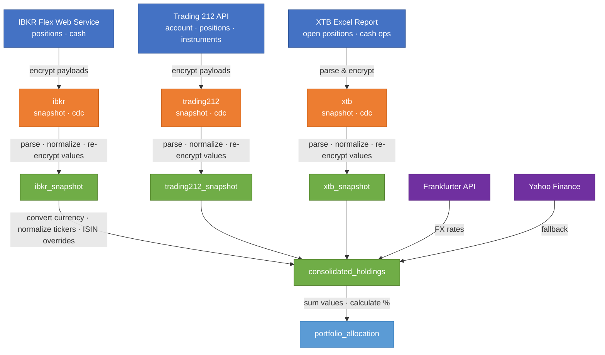
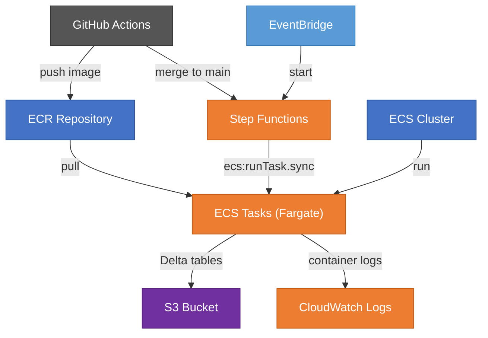

# Cloud-Based Financial Portfolio Lakehouse Pipeline

Data engineering pipeline for ingesting, normalizing, and querying
multi-broker financial portfolio data with Delta Lake, S3-compatible storage,
and medallion architecture.

## Medallion Pipeline

The `pipeline/` package implements a medallion architecture (raw → normalized →
analytics) with Delta tables and Fernet encryption for sensitive financial data.

### Data flow



Each layer stores data in Delta tables under `data/`:

| Layer | Node color | Table | Contents |
|-------|-----------|-------|----------|
| 🔵 Sources | Blue | — | Broker APIs and files |
| 🟠 Raw | Orange | `raw/{broker}_snapshot` | Encrypted API payloads with fetch metadata |
| 🟠 Raw | Orange | `raw/{broker}_cdc` | Encrypted change-data-capture payloads |
| 🟢 Normalized | Green | `normalized/{broker}_snapshot` | Structured positions & cash rows; financial values remain Fernet-encrypted |
| 🟢 Normalized | Green | `normalized/consolidated_holdings` | Cross-broker holdings converted to target currency; financial values remain Fernet-encrypted |
| 🟣 FX Rates | Purple | — | Frankfurter API (primary) / Yahoo Finance (fallback) |
| 🔵 Analytics | Light blue | `analytics/portfolio_allocation` | Ticker percentages by broker |

### IBKR Flex Web Service

IBKR data is fetched through the Flex Web Service API — no local gateway
process or browser login is required. Data has a 15–30 minute delay compared
to real-time positions.

To set up: log in to [IBKR Client Portal](https://portal.interactivebrokers.com),
navigate to **Performance & Reports → Flex Queries**, create an **Activity Flex
Query** named `get-open-positions` with the Open Positions and Account
Information fields you need, set Format to XML and Period to Last Business Day.
Enable **Flex Web Service Configuration** and generate a token.

### Setup

```powershell
python -m venv .venv
.venv\Scripts\Activate.ps1
pip install -e ".[pipeline]"
.venv\Scripts\python -m pipeline.run keygen   # generate encryption key (once)
```

### Docker

```bash
docker compose build
docker compose up minio -d
docker compose run --rm pipeline full
docker compose run --rm pipeline query "SELECT * FROM portfolio_allocation_analytics"
```

Data persists in the `minio-data` Docker volume. Secrets come from `.env`
(via `env_file` in docker-compose). MinIO console at http://localhost:9001
(login: `minioadmin` / `minioadmin`).

### Secrets Management

**Secrets (API keys, encryption keys) are never stored in config files or S3.**
They come from environment variables, set by one of two sources:

1. **`.env` file (local dev)** — create a `.env` file in the project root
   (gitignored) with your secrets. The pipeline loads it automatically at
   startup via `python-dotenv`.

2. **GitHub Secrets (CI)** — set in your repository settings. The pipeline
   workflow injects them as environment variables at runtime.

| Variable | Purpose |
|----------|---------|
| `IBKR_FLEX_TOKEN` | IBKR Flex Web Service token |
| `IBKR_FLEX_QUERY_ID` | IBKR Flex Query ID |
| `IBKR_FLEX_BASE_URL` | IBKR Flex Web Service base URL (default: `https://ndcdyn.interactivebrokers.com/AccountManagement/FlexWebService`) |
| `IBKR_ENABLED` | Enable/disable IBKR connector (default: enabled) |
| `T212_API_KEY` | Trading 212 API key |
| `T212_API_SECRET` | Trading 212 API secret |
| `T212_BASE_URL` | Trading 212 API base URL (auto-derived from `DEMO`) |
| `T212_ENABLED` | Enable/disable Trading 212 connector (default: enabled) |
| `XTB_ENABLED` | Enable/disable XTB connector (default: enabled) |
| `ENCRYPTION_KEY` | Fernet key for encrypting financial values |
| `DEMO` | Run in demo mode — uses `_DEMO` secrets and separate storage (default: `false`) |
| `STORAGE_TYPE` | Storage backend: `cloud`, `minio`, or `local` |
| `S3_BUCKET` | S3 bucket for cloud storage |
| `AWS_ACCESS_KEY_ID` | AWS credential for S3 |
| `AWS_SECRET_ACCESS_KEY` | AWS credential for S3 |
| `AWS_REGION` | AWS region (default: `eu-west-1`) |
| `S3_ENDPOINT_URL` | Custom S3 endpoint (for MinIO or other S3-compatible stores) |
| `S3_ALLOW_HTTP` | Allow non-HTTPS connections to S3 endpoint (set to `true` for MinIO) |

**Demo mode variables** (used when `DEMO=true`): `IBKR_FLEX_TOKEN_DEMO`,
`IBKR_FLEX_QUERY_ID_DEMO`, `T212_API_KEY_DEMO`, `T212_API_SECRET_DEMO`,
`ENCRYPTION_KEY_DEMO`, `S3_BUCKET_DEMO`, `S3_PREFIX_DEMO`,
`AWS_ACCESS_KEY_ID_DEMO`, `AWS_SECRET_ACCESS_KEY_DEMO`.

All connectors are **enabled by default**. Set a toggle to `0`, `false`, or
`no` to disable it.

### Cloud Storage (S3)

When `S3_BUCKET` is set, the pipeline uses `S3Backend` to store Delta tables
in S3. AWS credentials come from `AWS_ACCESS_KEY_ID`,
`AWS_SECRET_ACCESS_KEY`, and `AWS_REGION`. No additional dependencies
are needed — `deltalake` handles S3 natively via its Rust `object_store`
crate.

For S3-compatible stores like MinIO, set `S3_ENDPOINT_URL` to the server
URL (e.g. `http://minio:9000`) and `S3_ALLOW_HTTP=true` to allow non-HTTPS
connections. The Docker setup uses MinIO by default.

The `keygen` command only works in local mode. For S3, set
`ENCRYPTION_KEY` as an environment variable — **the encryption
key is never stored in S3.**

### Run the pipeline

**Local:**
```powershell
.venv\Scripts\python -m pipeline.run full
```

**Cloud (S3):**
```powershell
$env:S3_BUCKET = "your-bucket"
$env:AWS_ACCESS_KEY_ID = "..."
$env:AWS_SECRET_ACCESS_KEY = "..."
$env:ENCRYPTION_KEY = "..."
.venv\Scripts\python -m pipeline.run full
```

**GitHub Actions (manual dispatch):**
Go to Actions → Pipeline → Run workflow. Secrets are injected automatically
from GitHub Secrets.

### Querying data

```bash
# List all tables
python -m pipeline.run query "SHOW TABLES"

# Query with human-readable output
python -m pipeline.run query "SELECT * FROM portfolio_allocation_analytics"

# Decrypt encrypted columns
python -m pipeline.run query "SELECT * FROM ibkr_snapshot_normalized" --decrypt

# Export as CSV or JSON
python -m pipeline.run query "SELECT ticker, percentage FROM portfolio_allocation_analytics" --format csv
```

Table names follow the `{name}_{layer}` convention:

| Table | Layer |
|-------|-------|
| `ibkr_snapshot_raw` | Raw |
| `ibkr_snapshot_normalized` | Normalized |
| `trading212_snapshot_raw` | Raw |
| `trading212_snapshot_normalized` | Normalized |
| `xtb_snapshot_raw` | Raw |
| `xtb_snapshot_normalized` | Normalized |
| `consolidated_holdings_normalized` | Normalized |
| `portfolio_allocation_analytics` | Analytics |

## AWS Infrastructure

The pipeline runs on AWS Fargate, orchestrated by Step Functions, with
per-environment isolation (demo / prod). Terraform in `terraform/` manages
all resources.

### Architecture



### Terraform apply order

```bash
# 1. Shared infrastructure (ECR, ECS cluster, IAM roles) — once
cd terraform/shared
terraform init
terraform apply

# 2. Copy shared outputs into env tfvars
#    terraform output ecr_repository_url
#    terraform output ecr_push_pull_policy_arn
#    terraform output ecs_cluster_arn

# 3. Per-environment infrastructure — each independently
cd terraform/demo
terraform init
terraform apply

cd terraform/prod
terraform init
terraform apply
```

### Post-apply steps

1. **Seed SSM secrets** — Terraform creates parameter names with `PLACEHOLDER`
   values and `lifecycle ignore_changes`. Set real values manually:
   ```bash
   aws ssm put-parameter --name /portfolio/demo/IBKR_FLEX_TOKEN_DEMO \
     --value "real-token" --type SecureString --key-id <kms-key-id>
   ```
2. **Push Docker image** to ECR so task definitions have something to run.
3. **Store outputs** in GitHub Secrets: `access_key_id`, `s3_bucket`, `s3_prefix`
   (and `_DEMO` variants for demo).

### CI/CD

| Trigger | Action |
|---------|--------|
| Push to `main` | Build & push Docker image → start demo Step Functions execution |
| Tag push `v*` | Build & push Docker image with version tag + `production-latest` |
| Manual dispatch | Run pipeline directly via GitHub Actions (supports demo toggle) |

### Tests & Linting

```powershell
.venv\Scripts\python -m pytest
.venv\Scripts\python -m ruff check .
.venv\Scripts\python -m ruff format --check .
```
