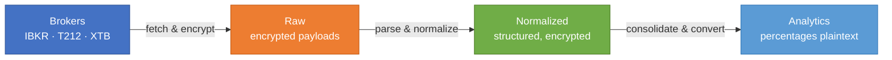
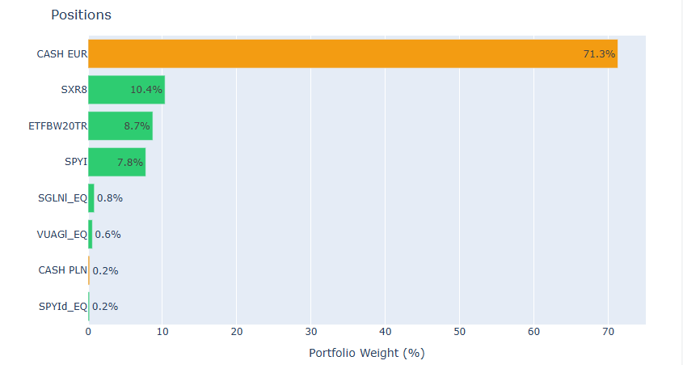
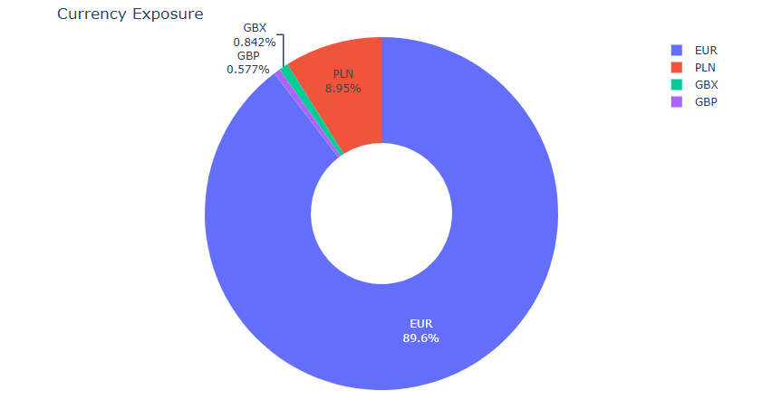
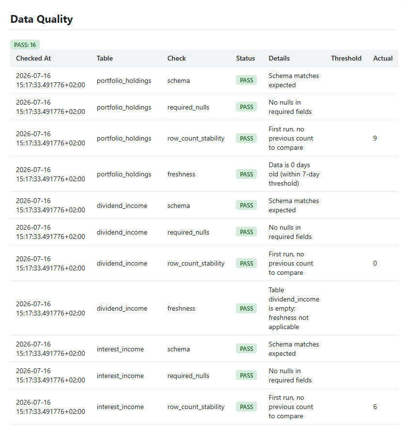

# Cloud-Based Financial Portfolio Lakehouse

Data engineering pipeline for ingesting, normalizing, and querying
multi-broker financial portfolio data with Delta Lake, S3-compatible storage,
and medallion architecture. Supports IBKR, Trading 212, and XTB. Runs locally
with MinIO or on AWS with S3 + Step Functions.

## Features

- **Multi-broker ingestion** — IBKR Flex Web Service, Trading 212 REST API, XTB Excel reports
- **Medallion architecture** — raw (encrypted payloads) → normalized (structured, encrypted) → analytics (percentages in plaintext)
- **Fernet encryption** — financial values encrypted at rest; decrypted on demand via `--decrypt`
- **Cross-broker consolidation** — holdings merged, currencies converted, tickers normalized
- **Interactive HTML reports** — allocation, positions, currency exposure, data quality badges
- **Delta Lake storage** — local filesystem, MinIO (Docker), or AWS S3
- **Docker Compose** — one-command local setup with MinIO
- **AWS deployment** — ECS Fargate + Step Functions orchestration, Terraform-managed
- **CDC tables** — change data capture for dividends, interest, and cash flow

## Architecture

The pipeline follows a medallion architecture: broker data flows through
encrypted raw storage → normalized structured tables → consolidated analytics
with currency conversion. Financial values remain Fernet-encrypted through
the raw and normalized layers; only percentage calculations are stored in
plaintext.



See [Architecture & Data Flow](docs/architecture.md) for the full Mermaid
diagram, layer table, and naming convention. See
[Table Lineage](docs/table-lineage.md) for the comprehensive lineage diagram.

## Screenshots

Sample report output generated from demo data for presentation purposes.





## Tech Stack

- **Python 3.11+** — Delta Lake, DuckDB, Polars, Plotly, Jinja2
- **Encryption** — Fernet (cryptography) for financial values at rest
- **Local** — Docker + MinIO (S3-compatible object store)
- **Cloud** — AWS ECS Fargate, Step Functions, S3, SSM, ECR, KMS
- **Infrastructure** — Terraform (shared, demo, prod environments)
- **CI/CD** — GitHub Actions (lint, test, build, deploy)

## Quick Start

### Prerequisites

- Python 3.11+ or Docker
- An IBKR Flex Web Service token (if using the IBKR connector)

### Run with Docker

```bash
docker compose build
docker compose up minio -d
docker compose run --rm pipeline full
docker compose run --rm pipeline query "SELECT * FROM portfolio_holdings_analytics" --decrypt
```

### Run locally

```powershell
python -m venv .venv
.venv\Scripts\Activate.ps1
pip install -e ".[pipeline]"
.venv\Scripts\python -m pipeline.run keygen   # generate encryption key (once)
.venv\Scripts\python -m pipeline.run full
```

### Query data

```bash
# List all tables
python -m pipeline.run query "SHOW TABLES"

# Query with decryption
python -m pipeline.run query "SELECT * FROM portfolio_holdings_analytics" --decrypt

# Export as CSV
python -m pipeline.run query "SELECT ticker, percentage FROM portfolio_holdings_analytics" --format csv
```

For detailed instructions, see [Local Deployment](docs/deployment/local.md).

## Configuration

Broker API keys, encryption keys, and storage settings come from environment
variables. Copy [`.env.example`](.env.example) to `.env` and fill in your
values — the pipeline loads it via `python-dotenv`.

See the [Configuration Guide](docs/configuration.md) for details on secrets
management, demo mode, S3 setup, and MinIO configuration.

Broker-specific setup:
- [IBKR Flex Web Service](docs/brokers/ibkr.md)
- [Trading 212 API](docs/brokers/trading212.md)
- [XTB Excel Reports](docs/brokers/xtb.md)

## Project Structure

```
pipeline/
  connectors/       # IBKR, Trading 212, XTB data ingestion
  raw/              # Raw layer: encrypt and store broker payloads
  normalized/       # Silver layer: parse, normalize, re-encrypt
  analytics/        # Gold layer: portfolio holdings, dividends, etc.
  migrations/       # Delta table schema migrations
  report/           # HTML report generation (Plotly charts)
  crypto.py         # Fernet encryption utilities
  run.py            # CLI entry point
  query.py          # SQL query CLI
  s3.py             # S3 storage backend
  storage.py        # Storage abstraction (local/MinIO/S3)
docs/
  architecture.md   # Data flow and layer details
  table-lineage.md  # Comprehensive Mermaid lineage diagram
  configuration.md  # Env vars, secrets, broker setup
  brokers/          # Per-broker setup guides
  deployment/       # Local and AWS deployment docs
  adr/              # Architecture Decision Records
  roadmaps/         # Project roadmaps
  screenshots/      # Generated chart images
terraform/          # AWS infrastructure (shared, demo, prod)
tests/              # pytest test suite
```

## Development

```powershell
.venv\Scripts\python -m pytest
.venv\Scripts\python -m ruff check .
.venv\Scripts\python -m ruff format --check .
```

Run `ruff check --fix .` and `ruff format .` before committing.

## Deployment

- [Local Development](docs/deployment/local.md) — venv or Docker setup
- [AWS Deployment](docs/deployment/aws.md) — ECS, Step Functions, Terraform, CI/CD

## Documentation

- [Architecture & Data Flow](docs/architecture.md) — medallion layers, table naming
- [Table Lineage](docs/table-lineage.md) — comprehensive Mermaid lineage diagram
- [Configuration](docs/configuration.md) — env vars, secrets, broker setup
- [Broker Setup](docs/brokers/ibkr.md) — IBKR, Trading 212, XTB
- [ADR Index](docs/adr/README.md) — 86 architecture decision records
- [Roadmap Index](docs/roadmaps/README.md) — active and completed roadmaps

## License

This is a personal project. No license has been applied yet.
