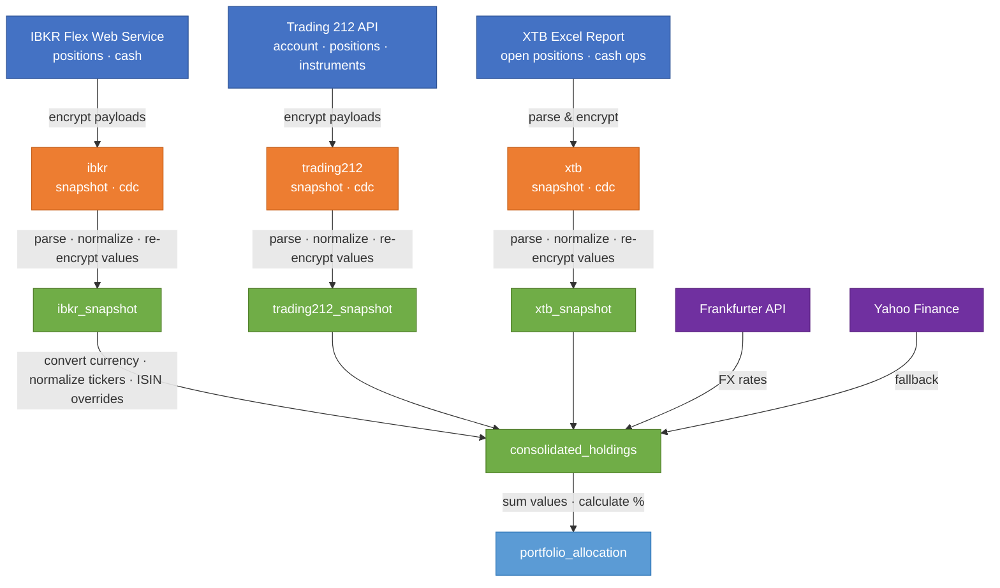

# Investment Portfolio Dashboard

Utilities for consolidating broker assets into a single portfolio view.

## Medallion Pipeline

The `pipeline/` package implements a medallion architecture (raw → normalized →
analytics) with Delta tables and Fernet encryption for sensitive financial data.

### Data flow



Each layer stores data in Delta tables under `data/`:

| Layer | Node color | Table | Contents |
|-------|-----------|-------|----------|
| 🔵 Sources | Blue | — | Broker APIs and files |
| 🟠 Raw | Orange | `raw/{broker}_snapshot` | Encrypted API payloads with fetch metadata |
| 🟠 Raw | Orange | `raw/{broker}_cdc` | Encrypted change-data-capture payloads |
| 🟢 Normalized | Green | `normalized/{broker}_snapshot` | Structured positions & cash rows; financial values remain Fernet-encrypted |
| 🟢 Normalized | Green | `normalized/consolidated_holdings` | Cross-broker holdings converted to target currency; financial values remain Fernet-encrypted |
| 🟣 FX Rates | Purple | — | Frankfurter API (primary) / Yahoo Finance (fallback) |
| 🔵 Analytics | Light blue | `analytics/portfolio_allocation` | Ticker percentages by broker |

### IBKR Flex Web Service

IBKR data is fetched through the Flex Web Service API — no local gateway
process or browser login is required. Data has a 15–30 minute delay compared
to real-time positions.

#### IBKR Flex Query setup

1. Log in to [IBKR Client Portal](https://portal.interactivebrokers.com).
2. Navigate to **Performance & Reports → Flex Queries**.
3. Click the **+** icon in the **Activity Flex Query** section to create a new
   query named `get-open-positions`.
4. In the **Open Positions** section, select these fields: Account ID, Currency,
   FX Rate To Base, Asset Class, Symbol, Description, Conid, ISIN, Listing
   Exchange, Report Date, Quantity, Mark Price, Position Value, Cost Basis
   Price, Cost Basis Money, Percent of NAV, Unrealized P/L, Side.
5. In the **Account Information** section, select: Net Liquidation Value,
   Cash Balance, Currency.
6. Set **Format** to XML, **Period** to Last Business Day, and
   **Include Currency Rates** to Yes.
7. Click **Continue → Create** and note the **Query ID** (a numeric ID).
8. On the same page, click the **gear icon ⚙️** next to **Flex Web Service
   Configuration**, toggle it to **Enable**, and click **Generate A New Token**.
   Copy the token immediately — it is shown only once.

### Setup

Create a venv and install dependencies:

```powershell
python -m venv .venv
.venv\Scripts\Activate.ps1
pip install -e ".[pipeline]"
```

Generate an encryption key (only needed once):

```powershell
.venv\Scripts\python -m pipeline.run keygen
```

### Secrets Management

**Secrets (API keys, encryption keys) are never stored in config files or S3.**
They come from environment variables, set by one of two sources:

1. **`.env` file (local dev)** — create a `.env` file in the project root
   (gitignored) with your secrets. The pipeline loads it automatically at
   startup via `python-dotenv`:

   ```bash
   # .env (never committed — copy from .env.example)
   IBKR_FLEX_TOKEN=your_token_here
   IBKR_FLEX_QUERY_ID=your_query_id_here
   T212_API_KEY=your_key_here
   T212_API_SECRET=your_secret_here
   ENCRYPTION_KEY=your_fernet_key_here
   ```

2. **GitHub Secrets (CI)** — set in your repository settings. The pipeline
   workflow injects them as environment variables at runtime.

Environment variables always take priority over `.env` file values.

| Variable | Purpose |
|----------|---------|
| `IBKR_FLEX_TOKEN` | IBKR Flex Web Service token *(required)* |
| `IBKR_FLEX_QUERY_ID` | IBKR Flex Query ID *(required)* |
| `IBKR_FLEX_BASE_URL` | IBKR Flex Web Service base URL (default: `https://ndcdyn.interactivebrokers.com/AccountManagement/FlexWebService`) |
| `IBKR_ENABLED` | Enable/disable IBKR connector (default: enabled) |
| `T212_API_KEY` | Trading 212 API key *(required)* |
| `T212_API_SECRET` | Trading 212 API secret *(required)* |
| `T212_DEMO` | Use Trading 212 demo API (default: `false`) |
| `T212_BASE_URL` | Trading 212 API base URL (auto-derived from `T212_DEMO`) |
| `T212_ENABLED` | Enable/disable Trading 212 connector (default: enabled) |
| `XTB_ENABLED` | Enable/disable XTB connector (default: enabled) |
| `ENCRYPTION_KEY` | Fernet key for encrypting financial values *(required)* |
| `S3_BUCKET` | S3 bucket for cloud storage (enables S3Backend) |
| `AWS_ACCESS_KEY_ID` | AWS credential for S3 |
| `AWS_SECRET_ACCESS_KEY` | AWS credential for S3 |
| `AWS_REGION` | AWS region (default: `eu-west-1`) |

All connectors are **enabled by default**. Set a toggle to `0`, `false`, or
`no` to disable it.

### Cloud Storage (S3)

When `S3_BUCKET` is set, the pipeline uses `S3Backend` to store Delta tables
in S3. AWS credentials come from `AWS_ACCESS_KEY_ID`,
`AWS_SECRET_ACCESS_KEY`, and `AWS_REGION`. No additional dependencies
are needed — `deltalake` handles S3 natively via its Rust `object_store`
crate.

The `keygen` command only works in local mode. For S3, set
`ENCRYPTION_KEY` as an environment variable — **the encryption
key is never stored in S3.**

### Configuration

All configuration is through environment variables. No config files needed —
set env vars in your shell, `.env` file, or GitHub Actions workflow.

Connectors are **enabled by default**. Set `IBKR_ENABLED=0`, `T212_ENABLED=0`,
or `XTB_ENABLED=0` to disable a connector.

See the [Secrets Management](#secrets-management) section for the full list of
environment variables.

### Run the pipeline

**Local (default — uses `data/` directory):**

```powershell
.venv\Scripts\python -m pipeline.run full
```

**Local with custom data directory:**

```powershell
$env:PIPELINE_DATA_DIR = "C:\path\to\data"
.venv\Scripts\python -m pipeline.run full
```

**Cloud (S3) — set environment variables:**

```powershell
$env:S3_BUCKET = "your-bucket"
$env:AWS_ACCESS_KEY_ID = "..."
$env:AWS_SECRET_ACCESS_KEY = "..."
$env:ENCRYPTION_KEY = "..."
.venv\Scripts\python -m pipeline.run full
```

**GitHub Actions (manual dispatch):**

Go to Actions → Pipeline → Run workflow. Secrets are injected automatically
from GitHub Secrets. See `.github/workflows/pipeline.yml`.

### Infrastructure

The `terraform/` directory contains Terraform configuration for the S3 bucket
and IAM user:

```bash
cd terraform
terraform init
terraform plan
terraform apply
```

After applying, store the outputs in GitHub:

- `s3_bucket` → GitHub Secret `S3_BUCKET`
- `access_key_id` → GitHub Secret `AWS_ACCESS_KEY_ID`
- `access_key_secret` → GitHub Secret `AWS_SECRET_ACCESS_KEY`

### Tests & Linting

```powershell
.venv\Scripts\python -m pytest
.venv\Scripts\python -m ruff check .
.venv\Scripts\python -m ruff format --check .
```