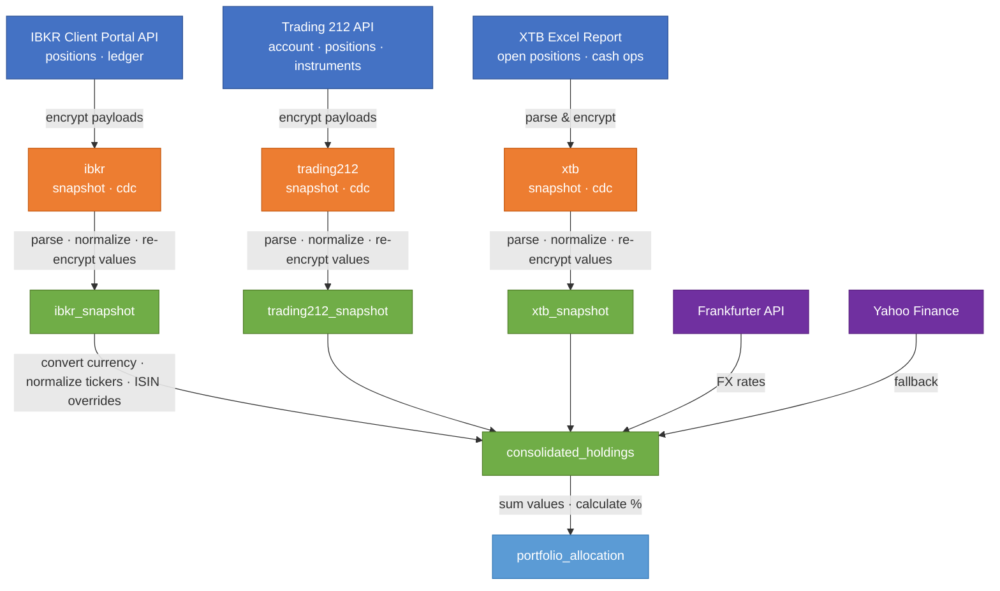

# Investment Portfolio Dashboard

Utilities for consolidating broker assets into a single portfolio view.

## IBKR Net Worth Percentages

The first script reads Interactive Brokers assets through the IBKR Flex Web
Service API and prints each position and cash balance as a percentage of net
worth. No local gateway or browser login is required.

> **Note:** Flex Query data has a 15–30 minute delay compared to real-time
> positions from the Client Portal Gateway.

### IBKR setup

1. Log in to [IBKR Client Portal](https://portal.interactivebrokers.com).
2. Navigate to **Performance & Reports → Flex Queries**.
3. Click the **+** icon in the **Activity Flex Query** section to create a new
   query named `get-open-positions`.
4. In the **Open Positions** section, select these fields: Account ID, Currency,
   FX Rate To Base, Asset Class, Symbol, Description, Conid, ISIN, Listing
   Exchange, Report Date, Quantity, Mark Price, Position Value, Cost Basis
   Price, Cost Basis Money, Percent of NAV, Unrealized P/L, Side.
5. In the **Account Information** section, select: Net Liquidation Value,
   Cash Balance, Currency.
6. Set **Format** to XML, **Period** to Last Business Day, and
   **Include Currency Rates** to Yes.
7. Click **Continue → Create** and note the **Query ID** (a number like
   `1554188`).
8. On the same page, click the **gear icon ⚙️** next to **Flex Web Service
   Configuration**, toggle it to **Enable**, and click **Generate A New Token**.
   Copy the token immediately — it is shown only once.

### Run

```powershell
python .\scripts\ibkr_net_worth.py --ibkr-flex-token YOUR_TOKEN
```

Optional arguments:

```powershell
python .\scripts\ibkr_net_worth.py --ibkr-flex-token YOUR_TOKEN --ibkr-flex-query-id 1554188
python .\scripts\ibkr_net_worth.py --ibkr-flex-token YOUR_TOKEN --retries 10 --retry-delay 5
python .\scripts\ibkr_net_worth.py --ibkr-flex-token YOUR_TOKEN --timeout 60
```

The script calls:

- `GET /sso/validate` to verify the gateway login session.
- `GET /portfolio/accounts` to discover accounts.
- `GET /portfolio2/{accountId}/positions` to fetch near-real-time positions.
- `GET /portfolio/{accountId}/ledger` to fetch cash and net liquidation value.

With `--require-brokerage-session`, the script also calls
`POST /iserver/auth/status`. Use that only when you need to verify the active
brokerage session and are prepared for IBKR to disconnect competing sessions.

Position values and cash balances are converted into the account base currency
using ledger exchange rates before percentages are calculated.

## Trading 212 Net Worth Percentages

The Trading 212 script prints the same net worth percentage table using the
Trading 212 public API. Pass both the API key and API secret on the command line so credentials
are not stored in this repository or in a config file. The `--account-id` parameter is optional.

```powershell
python .\scripts\trading212_net_worth.py --api-key "YOUR_API_KEY" --api-secret "YOUR_API_SECRET"
```

For a demo account:

```powershell
python .\scripts\trading212_net_worth.py --api-key "YOUR_DEMO_API_KEY" --api-secret "YOUR_DEMO_API_SECRET" --demo
```

Optional arguments:

```powershell
python .\scripts\trading212_net_worth.py --base-url https://live.trading212.com/api/v0
python .\scripts\trading212_net_worth.py --skip-metadata
python .\scripts\trading212_net_worth.py --timeout 30
python .\scripts\trading212_net_worth.py --user-agent "Mozilla/5.0 ..."
```

The script calls:

- `GET /equity/account/summary` to read account currency, cash, and total value.
- `GET /equity/positions` to read open positions.
- `GET /equity/metadata/instruments` to display instrument currencies unless
  `--skip-metadata` is used.

## XTB Net Worth Percentages

The XTB script prints the same net worth percentage table from an exported XTB
Excel report. Pass an absolute path to the `.xlsx` file so the script can be run
from any working directory.

```powershell
python .\scripts\xtb_net_worth.py --file "C:\Users\you\Downloads\account_00000000_en_xlsx_2005-12-31_2026-06-15.xlsx"
```

Optional arguments:

```powershell
python .\scripts\xtb_net_worth.py --file "C:\path\to\report.xlsx" --account-id "XTB-1"
```

The script reads:

- The `OPEN POSITION...` sheet to parse account id, currency, balance, equity,
  and open positions.
- The `CASH OPERATION...` sheet as a fallback source for cash when the open
  position sheet does not contain a balance.

Each XTB open-position row is a lot. The script calculates lot value as
`Purchase value + Gross P/L`, then aggregates lots by symbol so the output has
one row per asset. Net worth uses the report `Equity` when present, otherwise it
falls back to the sum of parsed positions and cash.

## Consolidated Ticker Percentages

The consolidated script reads Trading 212, one or more XTB Excel reports, and
IBKR Client Portal Gateway data, converts all rows to one target currency, and
prints ticker, percentage, broker, identifier, security currency, and
description. Trading 212 broker tickers such as `IS3Nd_EQ` and `VWCE_DE_EQ` are
normalized to cleaner display tickers such as `IS3N` and `VWCE`.

The `--t212-account-id` argument is optional and will default to an empty string if not provided.

Identifiers use the best broker-native value available:

- Trading 212 and XTB use `ISIN:...` when broker data includes an ISIN.
- IBKR uses `IBKR:<conid>`, because `conid` is IBKR's native unique contract
  identifier and is more reliable than ISIN in Client Portal position data.
- Rows without an available identifier display `-`.

IBKR descriptions come from the Flex Query `description` field. XTB exports
may not include instrument currency or description, so those rows can show `-`
for currency and the symbol as description.

```powershell
python .\scripts\portfolio_percentages.py `
  --t212-api-key "YOUR_API_KEY" `
  --t212-api-secret "YOUR_API_SECRET" `
  --xtb-file "C:\path\to\xtb-report-1.xlsx" `
  --xtb-file "C:\path\to\xtb-report-2.xlsx" `
  --ibkr-flex-token "YOUR_FLEX_TOKEN" `
  --ibkr-flex-query-id 1554188 `
  --target-currency EUR
```

Example output:

```text
Ticker              % Broker       Identifier           Ccy  Description
----------------------------------------------------------------------------------------
GOOGL           6.19% IBKR         IBKR:208813719       USD  Alphabet Inc Class A
IS3N            6.50% Trading 212  ISIN:IE00...         EUR  iShares Core MSCI World
VVSM.DE         3.70% XTB          -                    -    VVSM.DE
```

When broker data does not include an ISIN, you can still pass explicit
ticker-to-ISIN mappings with `--isin` or `--isin-map-file`:

```powershell
python .\scripts\portfolio_percentages.py ... --isin SXR8.DE=IE00B5BMR087 --isin-map-file "C:\path\to\isins.csv"
```

The ISIN map CSV must contain `ticker` and `isin` columns:

```csv
ticker,isin
SXR8.DE,IE00B5BMR087
SXRV.DE,IE00B53SZB19
```

The Flex Query includes `FX Rate To Base` for each position, so currency
conversion to the account base currency is automatic.

Missing FX rates are fetched from Frankfurter first, then Yahoo Finance if the
first provider fails. To avoid network FX lookups or override a rate, pass rates
where one source-currency unit equals the given target-currency amount:

```powershell
python .\scripts\portfolio_percentages.py ... --fx-rate USD=0.92 --fx-rate PLN=0.23
```

To run the live FX integration check:

```powershell
$env:RUN_LIVE_FX_TESTS = "1"
python -m pytest tests\test_live_fx.py
```

## Medallion Pipeline

The `pipeline/` package implements a medallion architecture (raw → normalized →
analytics) with Delta tables and Fernet encryption for sensitive financial data.

### Data flow



Each layer stores data in Delta tables under `data/`:

| Layer | Node color | Table | Contents |
|-------|-----------|-------|----------|
| 🔵 Sources | Blue | — | Broker APIs and files |
| 🟠 Raw | Orange | `raw/{broker}_snapshot` | Encrypted API payloads with fetch metadata |
| 🟠 Raw | Orange | `raw/{broker}_cdc` | Encrypted change-data-capture payloads |
| 🟢 Normalized | Green | `normalized/{broker}_snapshot` | Structured positions & cash rows; financial values remain Fernet-encrypted |
| 🟢 Normalized | Green | `normalized/consolidated_holdings` | Cross-broker holdings converted to target currency; financial values remain Fernet-encrypted |
| 🟣 FX Rates | Purple | — | Frankfurter API (primary) / Yahoo Finance (fallback) |
| 🔵 Analytics | Light blue | `analytics/portfolio_allocation` | Ticker percentages by broker |

### Setup

Create a venv and install dependencies:

```powershell
python -m venv .venv
.venv\Scripts\Activate.ps1
pip install -e ".[pipeline]"
```

Generate an encryption key (only needed once):

```powershell
.venv\Scripts\python -m pipeline.run keygen
```

### Secrets Management

**Secrets (API keys, encryption keys) are never stored in config files or S3.**
They come from environment variables, set by one of two sources:

1. **`.env` file (local dev)** — create a `.env` file in the project root
   (gitignored) with your secrets. The pipeline loads it automatically at
   startup via `python-dotenv`:

   ```bash
   # .env (never committed)
   IBKR_FLEX_TOKEN=your_token_here
   T212_API_KEY=your_key_here
   T212_API_SECRET=your_secret_here
   PORTFOLIO_ENCRYPTION_KEY=your_fernet_key_here
   ```

2. **GitHub Secrets (CI)** — set in your repository settings. The pipeline
   workflow injects them as environment variables at runtime.

Environment variables always take priority over `.env` file values.

| Variable | Purpose |
|----------|---------|
| `IBKR_FLEX_TOKEN` | IBKR Flex Web Service token |
| `T212_API_KEY` | Trading 212 API key |
| `T212_API_SECRET` | Trading 212 API secret |
| `PORTFOLIO_ENCRYPTION_KEY` | Fernet key for encrypting financial values |
| `S3_BUCKET` | S3 bucket for cloud storage (enables S3Backend) |
| `S3_PREFIX` | S3 key prefix (default: `pipeline`) |
| `AWS_ACCESS_KEY_ID` | AWS credential for S3 |
| `AWS_SECRET_ACCESS_KEY` | AWS credential for S3 |
| `AWS_REGION` | AWS region (default: `eu-west-1`) |
| `PIPELINE_DATA_DIR` | Local data directory (default: `data/`) |

### Cloud Storage (S3)

When `S3_BUCKET` is set, the pipeline uses `S3Backend` to store Delta tables
in S3. AWS credentials come from `AWS_ACCESS_KEY_ID`,
`AWS_SECRET_ACCESS_KEY`, and `AWS_REGION`. No additional dependencies
are needed — `deltalake` handles S3 natively via its Rust `object_store`
crate.

The `keygen` command only works in local mode. For S3, set
`PORTFOLIO_ENCRYPTION_KEY` as an environment variable — **the encryption
key is never stored in S3.**

### Configuration

Non-secret settings use two YAML files:

- **`pipeline.defaults.yaml`** — committed defaults and sample config with comments
- **`pipeline.yaml`** — gitignored local overrides (never committed)

To get started, copy the defaults file and customize it:

```powershell
copy pipeline.defaults.yaml pipeline.yaml
# Then edit pipeline.yaml with your settings (enable connectors, set flex_query_id, etc.)
```

```yaml
# pipeline.yaml (gitignored — your local overrides)
connectors:
  ibkr:
    enabled: true
    flex_query_id: "0000000"  # your actual Flex Query ID
  trading212:
    enabled: true
```

**No secrets or data paths go in these files.** Secrets come from env vars only.

### Run the pipeline

**Local (default — uses `data/` directory):**

```powershell
.venv\Scripts\python -m pipeline.run full
```

**Local with custom data directory:**

```powershell
$env:PIPELINE_DATA_DIR = "C:\path\to\data"
.venv\Scripts\python -m pipeline.run full
```

**Cloud (S3) — set environment variables:**

```powershell
$env:S3_BUCKET = "your-bucket"
$env:AWS_ACCESS_KEY_ID = "..."
$env:AWS_SECRET_ACCESS_KEY = "..."
$env:PORTFOLIO_ENCRYPTION_KEY = "..."
.venv\Scripts\python -m pipeline.run full
```

**GitHub Actions (manual dispatch):**

Go to Actions → Pipeline → Run workflow. Secrets are injected automatically
from GitHub Secrets. See `.github/workflows/pipeline.yml`.

### Infrastructure

The `infra/` directory contains Terraform configuration for the S3 bucket
and IAM user:

```bash
cd infra
terraform init
terraform plan
terraform apply
```

After applying, store the outputs in GitHub:

- `s3_bucket` → GitHub Secret `S3_BUCKET`
- `access_key_id` → GitHub Secret `AWS_ACCESS_KEY_ID`
- `access_key_secret` → GitHub Secret `AWS_SECRET_ACCESS_KEY`

### Tests

```powershell
.venv\Scripts\python -m pytest
```