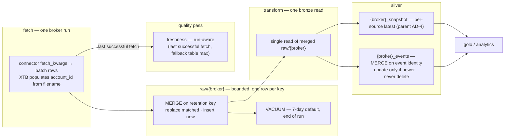

# Architecture Spine — Bounded Bronze Retention and Incremental Events

## Design Paradigm

**Bounded bronze, durable events.** The raw layer is a *bounded cache*: exactly one row per broker retention key (XTB account, Trading 212 endpoint, IBKR source), enforced at **write time** — the fetch itself is a Delta MERGE on that key, so there is no accumulation to dedupe or delete later, and no cross-run read of the accumulated table. The silver event layer is the *durable history*: an append-preserving table where rows are merged in on their event identity and **never deleted** because an event is absent from the current broker response. Freshness is a property of the *run* (a broker was fetched successfully at T), not of the stored bytes — so a repeated identical fetch can never read as stale. Both layers share one write primitive (Delta MERGE) with different conditions.

Everything structural from the parent feature spine (`single-bronze-per-broker`) holds: one `raw/{broker}` table, `source` discriminates data kind, transforms route by exact source gates, XTB is a first-class broker, silver stays two tables per broker.

## Inherited Invariants

Binding from the parent spine `single-bronze-per-broker` (feature, final) — read-only, not re-derived here:

| Inherited | From parent | Binds here |
| --- | --- | --- |
| AD-1 — one raw table per broker; `source` discriminates kind | single-bronze-per-broker | every fetch and transform target `raw/{broker}`; no per-layer raw paths may resurface |
| AD-2 — per-broker `source` vocabulary, defined once | single-bronze-per-broker | retention keys and routing read from the same vocabulary |
| AD-3 — transforms gate on `source` before payload unwrap (exact for IBKR/XTB, prefix-anchored for Trading 212) | single-bronze-per-broker | the incremental write path must not blur these gates |
| AD-4 — `filter_latest_snapshot` dedups per `source`; XTB per-`account_id` latest | single-bronze-per-broker | silver snapshot behavior is unchanged by this epic |
| AD-6 — XTB is a first-class broker, no name-branches, no raw-layer override | single-bronze-per-broker | the retention key must not be wired as a `name == "xtb"` special case |
| AD-7 + ADR 0113 A1 — migrations idempotent, `--dry-run`, run per environment before renamed/new code deploys | single-bronze-per-broker | this epic's raw-schema migration (AD-7 here) follows it |
| ADR 0105 — events dedup keeps `first` on `fetched_at`-descending (latest fetch wins) | project ADR 0105 | the event merge's precedence rule |
| ADR 0072 — empty-table freshness behavior | project ADR 0072 | run-aware freshness (AD-5 here) falls back to it |
| Stack pins (deltalake 1.6.0, polars 1.42.0, pyarrow 24.0.0, duckdb 1.5.4) | single-bronze-per-broker | no new dependencies |

**Conflicts surfaced — superseded, not overridden:** the parent spine froze `RAW_SCHEMA` ("account_id is a silver concept, never added to `RAW_SCHEMA`", carried from ADR 0047). This epic changes that: `RAW_SCHEMA` gains nullable `account_id` and drops `source_file` (AD-2 here). This is a deliberate supersede of the ADR 0047 clause and the parent's frozen-schema stance, recorded as a decision in the memlog — not a local silent override. The parent's AD-5 (fetch appends rows) is likewise superseded at the raw layer by write-on-key (AD-1 here). The active **ADR 0116** raw-write constraints — "the raw table append write and dedup behavior remain append-only; no `DeltaTable.merge`/bounded scans" — are also superseded by AD-1's merge-on-key (the merge *is* the bounded scan this epic exists to ship). ADR 0116's handoff capability design, its encrypted-pre-dedup contract, and the 1039 MB transform-peak analysis remain the baseline for AD-8's measurement; only the append-only/no-merge clause is replaced. No other inherited invariant is weakened.

## Invariants & Rules



Arrows point in the data-flow direction. One fetch → one merge write → one bronze read → two silver writes → gold; the run's fetch result drives the freshness pass.

### AD-1 — Retention is write-time merge-on-key; the retained set is never computed at read time

- **Binds:** CAP-1, CAP-4, every `fetch_*`, `raw/ingest.py`, the removed `dedup_raw` accumulation scan.
- **Prevents:** the divergence of "latest per key" being computed in two different places (fetch-write vs a separate retention sweep), a second implementer reintroducing the accumulated read-back that is the read/dedup work this epic exists to kill (issue #154 memory driver), and out-of-policy rows surviving on disk indefinitely because nothing ever removes them.
- **Rule:** the raw write for broker `B` is a `DeltaTable.merge(source, predicate)` of the current fetch's batch against `raw/{B}`, keyed on B's retention key — XTB `account_id`, Trading 212 and IBKR `source` (endpoint / Flex query). The merge uses `when_matched_update(updates=…)` (replace the matched row with the current fetch row — latest `fetched_at` wins by construction, since every write is a current fetch) and `when_not_matched_insert_all()`; rows whose key is absent from the current batch are **untouched** — a fetch never deletes a key it did not see. Before the merge, the batch is deduped on `(source, payload_hash)` so one batch cannot insert two identical rows. **Trading 212's merge key is the declared endpoint base — the pagination suffix is stripped from `source` before keying**, so cursor pages cannot fragment the key; the endpoint's final page is the complete response (ADR 0116: T212 events endpoints return the full history each run) and is what "latest complete response per endpoint" retains. A row whose retention key is **NULL** (an XTB filename that yields no account id — the contract's named risk) is **appended, never merged**: Delta MERGE predicates never match NULL, so a NULL-keyed row would insert on every run; the append + in-batch `(source, payload_hash)` dedup keeps it present and bounded instead. Per-endpoint `try/except` write-what-succeeded isolation and Trading 212's fail-loud all-events-endpoints-empty `RuntimeError` survive the merge unchanged (carried forward from the superseded parent AD-5). The cross-run `dedup_raw` scan (read accumulated `(source, payload_hash)` back) is deleted. This is the "write-time admission + scheduled VACUUM" option the spec's companion leaves open, chosen because it is atomic with the write and removes the read-back entirely.

### AD-2 — `RAW_SCHEMA` gains nullable `account_id`, drops `source_file`; XTB identity moves to fetch time

- **Binds:** CAP-1, `RAW_SCHEMA`, `raw/models.py`, XTB fetch + transform, the schema migration, every raw reader.
- **Prevents:** two builders placing the broker identity in different columns; a null-`account_id` collapsing unrelated non-XTB rows into one merge key; retention being impossible because the identity is derivable only from a dropped field.
- **Rule:** `RAW_SCHEMA = {fetched_at, broker, source, payload, payload_hash, account_id}` (nullable `account_id`, `source_file` removed). XTB's fetch populates `account_id` from the report filename at fetch time — **filename-first, inverting today's payload-first precedence** (the transform parses the payload only when the raw `account_id` is null, matching the spec's null-recovery fallback); IBKR and Trading 212 store `NULL` and never merge on it. The XTB transform groups on the raw `account_id`, recovers it by parsing the raw payload when null, and uses `fetched_at` plus `payload_hash` for any required deterministic tie-break. `(source, account_id)` with null `account_id` is **never** treated as one shared cross-broker key (do not merge non-XTB rows onto a null key). Supersedes ADR 0047's "`account_id` is a silver concept" clause (see Conflicts surfaced).

### AD-3 — VACUUM per run, Delta 7-day default, no retention override

- **Binds:** CAP-4, raw maintenance, run/deploy, every environment (docker/MinIO, staging, prod).
- **Prevents:** the false belief that a 7-day *default* is itself retention (the tombstone-deletion-ceiling + no automatic VACUUM failure mode the spec names); and the inverse — an aggressive low-retention override (`enforce_retention_duration=False`) that risks deleting live files under any concurrent reader.
- **Rule:** each broker run invokes `DeltaTable.vacuum(dry_run=False)` with the default retention (tombstone 7-day; `retention_hours` omitted, `enforce_retention_duration` stays True — `dry_run=False` is mandatory, since `vacuum` defaults to a no-op dry run that only lists files). Because the merge creates the tombstone during the write, VACUUM lands at the **end of each run**; at a 7-day threshold its position is behaviorally immaterial, so the spec's "before every fetch" reads as "once per run". Logical removal (merge replace), physical removal (VACUUM), and transaction-log history (30-day Delta default) remain the distinct mechanisms — none is a substitute for another.
- **Operational boundary of "a run":** in staging/prod each connector is one ECS/Fargate task via the Step Functions Map state (ADRs 0051/0052/0091); XTB runs in its own EventBridge file-arrival task (ADR 0110) and **that task also vacuums `raw/xtb`**; docker mode runs connectors in parallel per broker. Each connector task vacuums its own `raw/{broker}` only — this policy never vacuums the silver event tables.

### AD-4 — Event tables are append-preserving MERGEs on event identity (CAP-2)

- **Binds:** CAP-2, each broker's events normalization write (`run.py` write path), `dedup_events`.
- **Prevents:** today's `mode="overwrite"` per-broker events write (`run.py:301-306`) discarding every event absent from the current broker response — the Flex window-loss failure CAP-2 exists to kill — and an implementer "simplifying" to a delete-then-insert that has the same bug.
- **Rule:** the events write is a `DeltaTable.merge(source, predicate)` of the run's normalized event rows (pre-deduped in-batch by `dedup_events`) on the **full per-broker event identity, which equals each broker's in-batch dedup subset**: IBKR `event_id`; Trading 212 `(event_type, event_id)` (ADR 0105 — `event_type` scopes separate ID spaces); XTB `(event_type, event_id, account_id)`. The predicate must use the broker's full subset — never `event_id` alone — so the merge is idempotent and cannot collapse same-ID events across XTB accounts or across T212 order/dividend/transaction ID spaces. `when_matched_update(updates=…)` fires only when the incoming row's `fetched_at` is newer; `when_not_matched_insert_all()` otherwise. Nothing is ever deleted by a merge. Re-running a fetch converges. The write lives in `transform_connector`'s per-broker path (AD-6), replacing the `mode="overwrite"` at `run.py:301-306`.

### AD-5 — Freshness is run-aware — the table stores data, the run stores "it's fresh"

- **Binds:** CAP-3, `analytics/quality.py` freshness, `run.py` report/DQ pass.
- **Prevents:** issue #157 — freshness = `max(fetched_at)` of stored rows, which for a byte-identical re-fetch stays at the *first* stored payload's timestamp and warns stale although the run succeeded.
- **Rule:** the pipeline passes per-broker last-successful-fetch timestamps into the DQ freshness pass. A table whose broker was fetched successfully within the freshness window passes **regardless of whether any payload changed** (CAP-3). Table→broker mapping: each `{broker}_snapshot`/`{broker}_events` table maps to its single broker; the multi-broker consolidated tables (`events`, `consolidated_holdings`) map to the **max** last-successful-fetch over the brokers in that run. When the run context is absent (DQ invoked standalone, or the consolidated validation runs in its own Fargate task with no fetch times in memory — the "no new metadata table" rule means nothing persists), fall back to the existing table `max(fetched_at)` behavior unchanged (ADR 0072).

### AD-6 — One bronze read per broker run feeds both normalized outputs (CAP-5)

- **Binds:** CAP-5, `transform_connector`, each broker's `transform_snapshot`/`transform_events`.
- **Prevents:** the CAP-5 failure this spec names — a snapshot transform and an events transform each independently re-reading and re-parsing the same encrypted `raw/{broker}` payload, doubling read work and risking divergent decodes of the same bytes.
- **Rule:** `transform_connector` reads `raw/{broker}` **once** after the run's merge write, and the same read/decoded result is routed to both the snapshot and the events transforms. No downstream table independently re-reads or re-parses the bronze payload. Removing the Trading 212 handoff (AD-8) makes this single read the normal path.

### AD-7 — The raw-schema migration is the deploy gate, backfilling XTB `account_id` before `source_file` is dropped

- **Binds:** CAP-1, `pipeline/migrations/`, deployment per environment (staging, prod, docker/MinIO).
- **Prevents:** two deploy-time failures — deploying code that merges on `account_id` against tables that predate it (every legacy XTB row becomes NULL-keyed → re-inserted every run instead of replaced), and dropping `source_file` before the backfill has read it (the account identity is gone forever).
- **Rule:** a migration rewrites each `raw/{broker}` to the new `RAW_SCHEMA`, backfilling XTB `account_id` by parsing `source_file` (the retained filename → account id), then drops `source_file`. **The backfill parses the filename only** — an unparseable filename yields `NULL`, matching AD-1's append-for-null-key rule, and leaves the transform's payload-parse recovery as the sole recovery path (no payload parsing at migration time, so legacy rows get exactly one deterministic value). Idempotent with `--dry-run`, destination conflict raises — the ADR 0112 A1 convention. Runs manually per environment with **scheduled Step Functions executions paused** across the migration window (connectors idle = executions stopped, ADR 0110's file-arrival task included), then resumed after the new code deploys. Events tables need **no change** — the CAP-2 change swaps the write mechanism, not the schema.

### AD-8 — Trading 212 handoff removed as a measured experiment, with a material-regression rollback

- **Binds:** CAP-5, `BrokerConnector.handoff_supported`, `trading212` fetch/transform, the ADR 0116 baseline.
- **Prevents:** two implementers diverging — one deleting the handoff threading while another preserves it, and the removal shipping with no empirical gate to detect a material regression against the baseline it was introduced to beat.
- **Rule:** remove the in-memory encrypted-fetch handoff, so the single bronze read (AD-6) is the only path. Measure a representative Trading 212 run's memory peak and runtime against the existing handoff baseline (ADR 0116); if removal causes a **material** regression, restore the handoff. Either outcome must keep the one-shared-bronze-read guarantee (AD-6) intact.

## Consistency Conventions

| Concern | Convention |
| --- | --- |
| Naming | raw tables/paths/aliases unchanged (parent AD-1); event tables `{broker}_events` unchanged (ADR 0113); the retention key is `account_id` for XTB, `source` for Trading 212/IBKR — never a `kind`/`layer` column |
| Data & formats | Merge keys are never encrypted fields (`account_id`, `source`, `event_id`, `fetched_at` stay plaintext columns); the `payload` column stays Fernet-encrypted bytes (ADR 0047) |
| State & cross-cutting | One write primitive (Delta MERGE) for both raw and events; VACUUM per run with default retention; migrations idempotent, `--dry-run`, per-environment pre-deploy; freshness = run-aware with table fallback |
| Tests & regression guards | a re-fetch with a byte-identical payload does not warn stale; a key absent from the current response stays in raw and events; `SELECT DISTINCT source` per broker unchanged; merging the same batch twice is a no-op; XTB legacy rows (migrated) merge on `account_id`; a `dry_run=False` VACUUM physically removes tombstoned files past the 7-day threshold (CAP-4's "tested or verified for every environment"); paginated T212 pages merge onto their endpoint, never onto the cursor `source` |

## Stack

Seed — verified current at authoring (`pyproject.toml`, `venv`); the code owns this once it exists.

| Name | Version |
| --- | --- |
| Python | >= 3.11 |
| deltalake | 1.6.0 (DeltaTable.vacuum / merge / delete available) |
| polars | 1.42.0 |
| pyarrow | 24.0.0 (schemas + S3 fs only) |
| duckdb | 1.5.4 |
| ruff / pyright | 0.16.0 / 1.1.411 |
| Storage | S3 (staging/prod), MinIO via `S3_ENDPOINT_URL` (docker), local (tests) — via `StorageConfig` |

## Structural Seed

```text
pipeline/
  raw/
    models.py            # RAW_SCHEMA: fetched_at, broker, source, payload, payload_hash, account_id (nullable)
    ingest.py            # write_raw via DeltaTable.merge on the retention key; batch dedup (source, payload_hash);
                         #   cross-run dedup scan removed (AD-1); returns nothing / no in-memory handoff
    retention.py         # per-broker retention key + vacuum invocation (AD-1, AD-3) — thin, one source of truth
  connectors/
    xtb/fetch.py         # account_id from report filename at fetch time (AD-2); parse recovery in transform
    trading212/         # handoff_supported removed, memory baseline measured (AD-8)
    base.py              # BrokerConnector: no raw-layer override, no per-name branches (parent AD-6)
    transform_utils.py   # dedup_events stays (in-batch pre-dedup for AD-4)
  normalized/
    normalize.py         # unchanged — consolidated-currency read-modify-write, not the events write
  run.py                 # transform_connector: events write becomes DeltaTable.merge on the broker event identity (AD-4);
                         #   single bronze read per broker run (AD-6); passes run fetch times to freshness
  analytics/quality.py   # run-aware freshness: per-broker last-successful-fetch override + table fallback (AD-5)
  migrations/            # migrate_raw_account_id.py: backfill XTB account_id, drop source_file (AD-7)
```

## Capability → Architecture Map

| Capability / Area | Lives in | Governed by |
| --- | --- | --- |
| CAP-1 — bounded bronze storage | `raw/{broker}` write path | AD-1, AD-2, AD-3 |
| CAP-2 — incremental events | `normalize.py` events write | AD-4 |
| CAP-3 — freshness reflects the current fetch | `quality.py`, `run.py` | AD-5 |
| CAP-4 — explicit Delta retention policy | `retention.py`, per-broker fetch | AD-1, AD-3 |
| CAP-5 — single bronze read, both outputs | `transform_connector` | AD-6 |
| T212 handoff measurement | trading212 connector + tests | AD-8 |
| Raw schema change | `raw/models.py`, `migrations/` | AD-2, AD-7 |
| Migrations / deploy ordering | `pipeline/migrations/`, environments | AD-7 (inherit ADR-0112 A1) |

## Deferred

- **Content-time keying for XTB** (an older re-upload superseding a newer report) — unchanged from the parent; "latest `fetched_at` wins" stays the rule (ADR 0108 D18 trade-off).
- **Broker corrections / partial responses / truncation** — non-goal unless source contracts contradict the completeness assumption (spec constraint).
- **A second observability/metadata table** — non-goal; run-aware freshness (AD-5) deliberately avoids adding one.
- **Physical merge granularity** (per-batch vs all-batches-then-merge; `streamed_exec` on/off) — implementation detail under AD-1/AD-4, default to deltalake's engine choice.
- **Delta transaction-log history** — 30-day default, not tuned here.
- **Semantic canonicalization of broker payloads before hashing** — non-goal (spec); `payload_hash` is computed on the raw fetched bytes.
- **Replaying historical broker payloads after the retention window** — non-goal (spec); normalized event rows are the durable history.
- **Rollback of the handoff removal** — gated by AD-8's measurement, not a spine revision.
