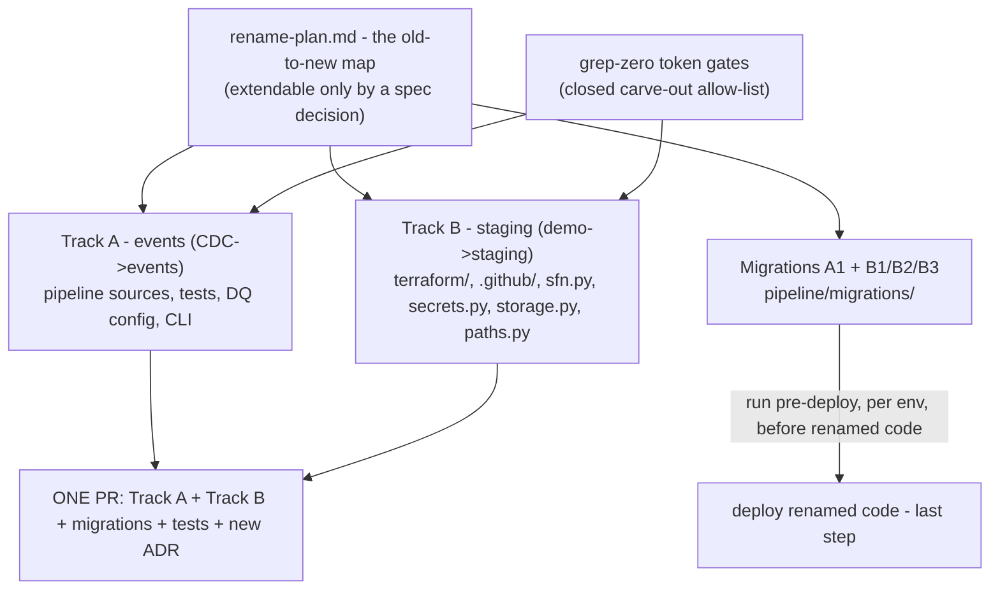

# Architecture Spine — Rename CDC->events and demo->staging (one PR)

## Design Paradigm

**Map-locked lockstep rename.** A coordinated rename of names that live in code symbols, Delta table paths, AWS resource names, and SSM parameter paths — where the risk is not *what to build* but *two builders diverging on which name wins*. The paradigm carries the whole model: an explicit old-to-new map is the single source of truth, every unit renames against the map (not against intuition), a migration runs before the deploy that ships the new names, and grep-zero sweeps verify completeness.

The map (rename-plan.md) is the lock. The gate (grep-zero bars) is the proof. Everything between is mechanical.



Dependency rule: implementers may depend on the map and on the token gates; migrations may depend on shared infra modules (`pipeline.secrets`, `pipeline.storage`) but not on renamed code; no unit may depend on `docs/adr/` (history is read-only); the two tracks stay independent and unify only in the single PR.

## Invariants & Rules

### AD-1 — The rename map is the single source of truth for every new name [ADOPTED]

- **Binds:** Track A, Track B, migrations, tests, docs, onboarding artifacts (CAP-1, CAP-2)
- **Prevents:** split-track drift — Track A picking "transactions" while the schema says `event_*`, either track inventing names outside the map, and the dual-owned entity trap (the state-machine name pinned in both `terraform/staging/main.tf` and `pipeline/sfn.py` `STATE_MACHINE_NAMES` drifting by one character and failing at runtime, not review)
- **Rule:** every renamed symbol, table path, AWS resource, SSM key, env name, and example reference (`.env.example`, `examples/`) must appear verbatim in rename-plan.md's "New" column. Track A: `fetch_cdc`→`fetch_events`, `dedup_cdc_events`→`dedup_events`, `consolidate_cdc_events`→`consolidate_events`, `cdc_events_normalized_schema`→`events_normalized_schema`, `_REQUIRED_CDC_BROKERS`→`_REQUIRED_EVENTS_BROKERS`, `RAW_*_CDC`/`NORMALIZED_*_CDC`→`*_EVENTS`, and the `run.py` step helpers `_consolidate_cdc`/`_normalize_cdc` with their user-facing error strings (the map's "CLI `consolidate-cdc`/`normalize-cdc`" row refers to these helpers — no such argparse subcommands exist). Track B code owners: `STATE_MACHINE_NAMES`, `MODE_TO_ENV_LABEL` (identity), `is_staging()`, `S3_PREFIX` default, `pipeline_staging`/`-staging` resources. Any "Old" token found outside `docs/adr/` that is not in the map is a gap: raise it — never improvise. Residual `*cdc*` components the map does not enumerate (`ibkr_cdc_raw_schema`, `decrypt_cdc_payloads`, `_CDC_ENCRYPT_COLUMNS`, …) rename by pattern to `*_events*`; the map is extendable only by a recorded decision.

### AD-2 — Rename by semantic role, never by token string [ADOPTED]

- **Binds:** all units, especially where the same token recurs
- **Prevents:** the `is_demo` split — one unit renaming the staging-mode predicate to `is_staging` while another uniform-renames the IBKR broker-tier param to `is_staging` (it must be `is_paper`), or a sweep over "demo" breaking the Trading 212 practice API
- **Rule:** classify each occurrence by role before renaming:
  - (a) **pipeline environment mode** → `staging`: `secrets.is_demo()`→`is_staging()`, `MODE_TO_ENV_LABEL` **removed** — `_env_label(mode)` returns `mode` directly (identity mapping is dead indirection; unsupported-mode `ValueError` guard kept; decision 2026-08-19), `env_label = "staging"`, SSM `/portfolio/staging/*`, S3 `investment-portfolio-pipeline-staging`, data prefix removed (empty)
  - (b) **broker product tier** → the broker's own vocabulary: Trading 212 keeps `demo` (`demo.trading212.com`, `DEMO_BASE_URL`/`_DEMO_BASE_URL`); IBKR uses `paper` (`is_paper`, `_inject_paper_deposit`, `_PAPER_INITIAL_DEPOSIT_AMOUNT`)
  - (c) **stale local project jargon** → the map's target
  - (d) **data-embedded sentinels are data, not names**: the raw `source` value `flex_cdc` (IBKR payload) is a column value, not a symbol. The CAP-1 bar forces its code-constant rename (`flex_events`) and the historical raw `source` values **are rewritten by migration A1 in place before the renamed transform deploys** — a code-only rename silently skips every historical IBKR row. Ratified 2026-08-19 (rename + data rewrite; CAP-3 verify counts `source`-gated `events` rows, not just table names)

### AD-3 — The grep-zero sweeps are the closed enforcement gate [ADOPTED]

- **Binds:** every unit's definition of done (CAP-1, CAP-2)
- **Prevents:** the rename's core failure mode — residual tokens surviving unnoticed and the feature "shipping" red
- **Rule:** CAP-1 bar — `grep -rni "cdc" pipeline/ tests/ docs/` (excluding `docs/adr/`) returns zero; CAP-2 bar — `grep -rni "demo"` over `pipeline/ tests/ terraform/ .github/ docs/ README.md` returns zero outside the fixed carve-outs: `docs/adr/`, `docs/_vendor/`, `docs/roadmaps/`, `_bmad-output/`, plus the Trading 212 tier tokens (`demo.trading212.com`, `DEMO_BASE_URL`/`_DEMO_BASE_URL`). The carve-out list is **closed** — no additions without a spec decision. **Historical-reference artifacts are exempt by construction**: committed migration scripts (`pipeline/migrations/*`) and their tests, plus terraform state-move blocks (`moved`/`state mv`), reference pre-rename names as their *inputs* — the same category as `docs/adr/`; the bars govern live names. (The exemption extends to migration-artifact tests because they exercise the exempted scripts by module path — e.g. `tests/test_migrate_cdc_events_drop_gross_amount.py` imports `pipeline.migrations.migrate_cdc_events_drop_gross_amount` and fixtures `cdc_events` temp tables; verified against PR #143's additions 2026-08-19.) A unit is done only when its sweep over live names returns zero. (Both ratifications landed 2026-08-19: the historical-reference exemption, and the CAP-1 `docs/` extension — for the `cdc` bar only `docs/adr/` is whitelisted, so the two `docs/roadmaps/*.md` files carrying "cdc" are in scope even though roadmaps keep the `demo`-bar carve-out.)

### AD-4 — Migration-first, deploy-last; data preservation is verified [ADOPTED]

- **Binds:** migration scripts, deploy workflow, CLI (CAP-3)
- **Prevents:** renamed code reading unmigrated tables, or a terraform apply referencing `/portfolio/staging/*` before the values exist
- **Rule:** strict sequence, per environment — the encrypted data is never in only one place:
  1. user sets `/portfolio/staging/*` (IBKR_FLEX_TOKEN, IBKR_FLEX_QUERY_ID, T212_API_KEY, T212_API_SECRET, ENCRYPTION_KEY) — same secret values, copied, never regenerated, never printed
  2. B1: object copy — old bucket `pipeline_demo/*` → new bucket root (empty prefix — buckets already isolate environments, ADR 0038/0039), encrypted data intact, old bucket untouched; prod `pipeline` prefix untouched
  3. terraform apply to staging (planned state migration — `moved` blocks or `terraform state mv`, never prod; never set `force_destroy` on the staging bucket). The IAM user `pipeline-demo`→`pipeline-staging` forces a recreate, so the operator re-exports the new access key to CI secrets before any post-migration deploy
  4. retire `/portfolio/demo/*` immediately after the swap is live
  5. A1: Delta renames `{broker}_cdc`→`{broker}_events` (raw + normalized) and `cdc_events`→`events`; plus any data-value rewrite AD-2(d) forces (historical `source = "flex_cdc"` → `"flex_events"`)
  6. verify identical row counts via `pipeline.run query --decrypt --mode staging` — table counts and, where a sentinel was renamed, transformed `events` row counts
  7. deploy the renamed code — **last**
  The copy (step 2) precedes any apply step that could destroy or repoint the bucket — a bucket-name change is a global rename (new bucket + copy), never an in-place rename. Migration scripts follow the live pattern (`pipeline/migrations/migrate_cdc_events_drop_gross_amount.py` — the XTB purge-legacy migration was removed in PR #143): run via `python -m pipeline.migrations.<name> --mode <env> [--dry-run]`, idempotent (exit 0 on absent or already-migrated, raise on genuine failures), credentials via `pipeline.migrations._storage_options` and `pipeline.storage.get_storage`, driven through the CLI module invocation.

### AD-5 — The immutables: what this rename must not touch [ADOPTED]

- **Binds:** all units
- **Prevents:** rename overshoot — "helpful" rewrites of history or adjacent systems
- **Rule:** `docs/adr/` content is never rewritten to "events"/"staging" (the rename supersedes the naming, not the decisions); `event_*` column names are already correct and unchanged; prod environment and its `pipeline` prefix are untouched (no prod terraform apply) — the one in-scope prod edit is the config flip `demo = false` → `staging = false` in `prod/main.tf` (spec Assumptions / plan B3), which is a code change, not an apply; Trading 212's tier tokens are the sole surviving "demo"; local-mode (docker/MinIO) names change only where a shared naming code path (e.g. `MODE_TO_ENV_LABEL`) forces it.

### AD-6 — Both tracks ship as one PR [ADOPTED]

- **Binds:** git workflow, checks, ADR record (CAP-4)
- **Prevents:** a partial merge that leaves a sweep red or the interlocked migrations half-applied
- **Rule:** one PR with Track A + Track B + migrations A1/B1-B3 + updated tests; merge only after `ruff`, `pyright`, `pytest` all green and migrations applied to staging with counts verified; a new ADR recording the events rename is created via `manage-adr` after merge, plus one for the demo→staging rename if the change merits it (per the plan) — old ADRs stay untouched.

## Consistency Conventions

| Concern | Convention |
| --- | --- |
| Naming (event layer) | Broker activity log is **events** everywhere: tables `{broker}_events` (raw+normalized) and `events` (normalized); `events_normalized_schema`, `_REQUIRED_EVENTS_BROKERS`, `fetch_events`/`fetch_events_kwargs`, `dedup_events`, `consolidate_events`, `events_tables.py`, path env `*_EVENTS`, CLI `consolidate-events`/`normalize-events`, DQ config keys under `events` |
| Naming (staging env) | Staging AWS assets carry `staging`: bucket `investment-portfolio-pipeline-staging` (empty data prefix), IAM `pipeline-staging`/`pipeline-staging-*`, VPC `pipeline_staging`, state machine `portfolio-pipeline-orchestrator-staging`, SSM `/portfolio/staging/*`, env label `staging`; `demo` survives only as T212's tier (`demo.trading212.com`, `DEMO_BASE_URL`/`_DEMO_BASE_URL`); IBKR tier is **paper**. The state-machine name is pinned in two owners (`terraform/staging/main.tf` and `pipeline/sfn.py` `STATE_MACHINE_NAMES`) — both flip together, in the map |
| Data & formats | Migrations: `--mode` + `--dry-run`, idempotent (exit 0 absent/already-migrated, raise on genuine failure), run pre-deploy per env; verification by row counts via `pipeline.run query --decrypt`; never hand-construct `DeltaTable()` |
| State & cross-cutting | Secrets: same values copied to new SSM paths, never regenerated; staging secrets set before terraform apply, `/portfolio/demo/*` retired immediately after; terraform moves via planned state migration or deliberate destroy/recreate; never `force_destroy` on the staging bucket; prod never applied (only the `prod/main.tf` `staging = false` flip); access-key re-exported to CI after the IAM user swap |
| Onboarding & examples | `.env.example` and `examples/` are in the map's scope — stale bucket/prefix/SSM examples point fresh checkouts at the old environment; docs/ non-ADR pages are renamed for "cdc" (CAP-1 bar extended, only `docs/adr/` exempt), including the file name `docs/ibkr/flex-query-required-fields-cdc.md` → `flex-query-required-fields-events.md` |

## Stack

Seed — verified current 2026-08-19; the rename does not change the stack, it renames within it.

| Name | Version |
| --- | --- |
| Python | >=3.11 |
| polars | 1.42.0 |
| deltalake | 1.6.0 |
| duckdb | 1.5.4 |
| pyarrow | 24.0.0 |
| ruff / pyright | 0.16.0 / 1.1.411 |

## Structural Seed

Where the rename lands (seed, owned by the code once it exists):

```
pipeline/migrations/migrate_cdc_to_events.py   # A1: Delta table renames, idempotent
pipeline/migrations/                           # B1-B3: bucket copy, SSM swap, terraform state
pipeline/{raw,normalized,analytics,connectors}/# renamed events-* symbols, files, schemas
pipeline/sfn.py                                # _env_label(mode) returns mode; state machine name
pipeline/secrets.py                            # is_staging() predicate, /portfolio/staging/*
pipeline/storage.py, pipeline/paths.py, pipeline/run.py  # empty staging prefix, *_EVENTS names, CLI
terraform/{staging,shared}/*.tf                # staging names, empty s3_prefix, moved blocks
.github/workflows/deploy-staging.yml           # CI deploy; re-exported access key after IAM user swap
docs/adr/                                       # new ADR after merge (old ADRs untouched)
```

## Deferred

- **CI enforcement of the grep bars** — the spec requires the sweeps as the success bar, not a CI lint gate; decide post-merge whether to add a guard.
- **Prod-side renames and the prod `pipeline` prefix** — out of scope beyond the `prod/main.tf` flip; the identity env-label applies at the next prod apply, which needs its own migration and review.
- **Old table/name cleanup after migration** — keep renamed-away Delta tables for rollback vs delete out-of-band; the XTB precedent left its orphaned raw table untouched (ADR 0108) rather than deleting; decide post-merge.
- **A1 mechanics** — per-table Delta `ALTER TABLE RENAME` vs S3 object copy preserving `_delta_log`; left to the migration author.

**Spec ratifications** (surfaced by the reviewer gate — they extend or touch the user-closed spec bars, so they are decisions, not spine calls):
- ✅ **AD-3 historical-reference exemption — RATIFIED 2026-08-19** (migration scripts + `moved`/`state mv` blocks may reference pre-rename names). Folded into AD-3.
- ✅ **CAP-1 `docs/` extension — RATIFIED 2026-08-19** (bar is `pipeline/ tests/ docs/`, excluding `docs/adr/`; user-facing docs must be refactored; only ADRs are whitelisted in `docs/` — the two `docs/roadmaps/*.md` "cdc" hits are in scope despite the `demo`-bar roadmaps carve-out). Folded into AD-3 and the conventions table.
- ✅ **`flex_cdc` (raw `source` value, IBKR) — RATIFIED 2026-08-19** (rename + data-value rewrite in A1; not exempted from the CAP-1 bar). Folded into AD-2(d).
