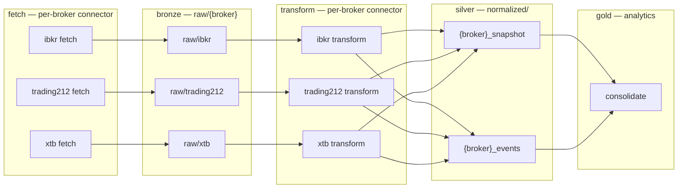
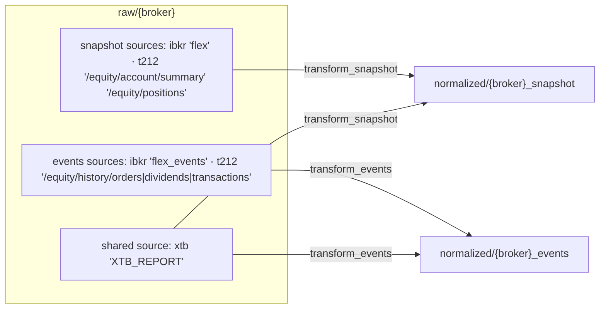

# Architecture Spine — Single Bronze Table per Broker

## Design Paradigm

**Medallion with a per-broker single bronze port.** Each broker is one source into the lake: its
fetch writes every payload — snapshot, positions, and events alike — into exactly one raw Delta
table (`raw/{broker}`), and the broker's two silver transforms read that same table and route rows
by the `source` column. The bronze table is the single boundary between fetch (write) and transform
(read + route); `source` is the only discriminator of data kind. This is the shape XTB proved (ADR
0110 D17, shared bronze) generalized to all brokers; the `name == "xtb"` branch in `fetch_connector`,
the `events_raw_layer` override attribute, and the per-layer raw paths are the scaffolding being
deleted, not design features.

The pipeline downstream is untouched: silver stays two tables per broker (`normalized/{broker}_snapshot`,
`normalized/{broker}_events`), consolidate merges across brokers into gold, analytics consume silver
only. This spine governs the bronze shape and the raw→silver routing contract; everything else is
inherited from the standing project decisions below.

## Standing Project Constraints (binding ADRs)

The project's ADRs bind this feature and are not re-decided here. The load-bearing ones:

| ADR | Binds this feature |
| --- | --- |
| 0102 | One shared snapshot normalized schema across brokers; the raw layer keeps its single shared `RAW_SCHEMA` — the merged table keeps it unchanged |
| 0110 D17 | XTB shared bronze: one `XTB_REPORT` raw row feeds both silvers — carried forward, not re-decided |
| 0113 | `events` naming is final (`{broker}_events`, `events_normalized_schema`); migration/table paths use the post-rename names |
| 0100 #1 (carried forward via 0108) | `filter_latest_snapshot` dedups per `source` — stays (AD-4) |
| 0087 #4 (carried forward via 0108) | Trading 212's all-events-endpoints-empty `RuntimeError` survives the merge (AD-5) |
| 0087 #5 (carried forward via 0108) | `transform_connector` logs a WARNING and skips an empty raw table — stays |
| 0112 / 0113 (A1) | Migration convention: idempotent, `--dry-run`, copy-verify-then-delete, destination-size conflict raises — the merge migration follows it (AD-7) |
| 0047 | Raw stores original payload bytes unmodified; parsing lives in the silver transform; `account_id` is a silver-layer concept, never added to `RAW_SCHEMA` |
| 0105 | Events dedup keeps `first` on `fetched_at`-descending (latest fetch wins); XTB adds `account_id` to the subset |

## Invariants & Rules



Arrows point in the data-flow direction. **`raw/{broker}` is written only by its broker's fetch and
read only by that broker's transforms plus query tooling (alias `{broker}_raw`).** No other code
depends on a per-layer raw table name; gold never reads raw.

### AD-1 — One raw table per broker; `source` discriminates data kind

- **Binds:** CAP-1, the raw layer, every connector.
- **Prevents:** the per-broker × per-layer raw multiplicity (`raw/{broker}_snapshot` + `raw/{broker}_events`, six identical-schema tables) returning, and a single global bronze across brokers.
- **Rule:** every raw row for broker `B` lands in `raw/{B}` — one Delta table, shared `RAW_SCHEMA`. The `source` column value carries the data kind; there are no per-layer raw paths. `get_raw_path(name, layer)` collapses to `raw/{name}` for both snapshot and events; the `RAW_*_SNAPSHOT`/`RAW_*_EVENTS` path constants are removed and the six `*_raw_schema` aliases collapse into the one shared `RAW_SCHEMA`. Query alias is `{broker}_raw` via auto-discovery — never a hardcoded alias registry.

### AD-2 — The source vocabulary is a per-broker routing contract, defined once

- **Binds:** CAP-1, CAP-3, fetch writers, transform readers.
- **Prevents:** fetch and transform drifting on source strings, and each transform re-deriving its own substring heuristics against a vocabulary it half-remembers.
- **Rule:** each broker module owns its source vocabulary — IBKR `flex` / `flex_events`; Trading 212 its five request paths `/equity/account/summary`, `/equity/positions`, `/equity/history/orders`, `/equity/history/dividends`, `/equity/history/transactions` (stored as the full captured request path, pagination suffixes possible); XTB `XTB_REPORT`. Fetch writes rows tagged with that vocabulary; transforms route on it. Transform source tests are membership in the declared set — exact for IBKR/XTB, prefix-anchored on the declared path for Trading 212 (pagination-tolerant) — never free substring matching.

### AD-3 — Transforms gate on `source` before payload unwrapping; the events gate is exact

- **Binds:** CAP-3, each broker's `transform_snapshot` and `transform_events`.
- **Prevents:** a bare-JSON-list snapshot payload (Trading 212 `/equity/positions`) being treated as events — the data-integrity failure this feature exists to make structurally impossible — and the `flex`/`flex_events` prefix collision leaking events payloads into the snapshot silver.
- **Rule:** both transforms include-filter on `source` before any payload unwrap or parse. `transform_events` admits only the broker's event sources; for IBKR the gate is exact `flex_events`, never `startswith("flex")`. `transform_snapshot` admits only snapshot sources; for IBKR the gate is exact `flex`. A row whose `source` is not in the admitted set is never unwrapped or parsed by that transform.

### AD-4 — Dedup stays per-`source`; routing is inclusive per transform, not a partition

- **Binds:** CAP-3, `transform_utils.filter_latest_snapshot`, each broker's `transform_snapshot`.
- **Prevents:** a future global-max dedup silently dropping streams, snapshot sources leaking into the events silver, and an implementer treating the routing diagram as a disjoint partition of rows.
- **Rule:** `filter_latest_snapshot` dedups per distinct `source` value — never a global max — with a regression guard on that keying. XTB keeps its per-`account_id` latest logic (ADR 0108 D18) over its single `XTB_REPORT` source. Source sets are per-transform include-sets, not a row partition: a row is consumed by every transform whose set admits it — XTB's snapshot and events transforms both admit `XTB_REPORT`, so one workbook row produces holdings AND events.

### AD-5 — Fetch writes rows to the single table; only the write target merges

- **Binds:** CAP-1, CAP-2, each broker's `fetch_*`.
- **Prevents:** API calls being merged (IBKR's two Flex queries, Trading 212's five endpoints) and per-layer write plumbing reappearing.
- **Rule:** each fetch kind appends its own rows — each row tagged with its `source` — to `raw/{broker}`. Per-endpoint `try/except` write-what-succeeded isolation stays; Trading 212's all-events-endpoints-empty `RuntimeError` (fetch.py:121) survives unchanged.

### AD-6 — XTB is a first-class broker: uniform protocol, no name-based branches, no raw-layer override

- **Binds:** CAP-2, `BrokerConnector` (base.py), `fetch_connector`/`transform_connector` (run.py).
- **Prevents:** the XTB special case re-forming — the `name == "xtb"` branch, the `events_raw_layer = "snapshot"` override, the never-invoked `fetch_events`/`fetch_events_kwargs` stubs — and XTB's multi-file `--xtb-file` support silently dropping to the first file.
- **Rule:** `fetch_connector` and `transform_connector` carry no per-broker-name logic. `BrokerConnector` has no raw-layer override attribute (`events_raw_layer` is removed) and no events stubs. Multi-file support is preserved by the uniform contract: `fetch_kwargs` returns one or more kwarg batches and the generic fetch path iterates them, appending each batch to `raw/{name}` (XTB keeps ingesting its list of `--xtb-file` uploads). Every connector writes `raw/{name}` and its transforms route by `source` exactly like IBKR and Trading 212.

### AD-7 — The merge migration is the deploy gate

- **Binds:** CAP-1, `pipeline/migrations/`, deployment and environments (staging, prod, docker/MinIO).
- **Prevents:** `transform_connector` silently skipping on a missing `raw/{broker}` with quality gates flagging missing tables, history loss, duplicate rows from a half-applied merge, and stale per-layer tables resurrecting dead `{broker}_snapshot_raw` aliases via query auto-discovery.
- **Rule:** the migration is idempotent, dedup-keyed on `(broker, source, payload_hash)` — the same key raw writes use, tie-breaking to the latest `fetched_at` and preserving `source_file` so XTB's `account_id` derivation (ADR 0108 D18) survives — and supports `--dry-run`. It merges `raw/{broker}_snapshot` + `raw/{broker}_events` into `raw/{broker}`, then removes every per-layer raw path (`{broker}_snapshot`, `{broker}_events`, including the orphaned `xtb_events`) so no stale aliases resurface. It runs manually per environment — `python -m pipeline.migrations.<script> --mode <docker|staging|prod> [--dry-run]`, matching the project's migration convention — before the renamed-path transform code deploys in that environment, so no live old fetch can re-create a per-layer path after it is removed (connectors idle across the window). A destination object with a different size raises a conflict (ADR 0113 A1 convention) rather than clobbering.

## Consistency Conventions

| Concern | Convention |
| --- | --- |
| Naming (tables, aliases, files) | Raw: `raw/{broker}` → query alias `{broker}_raw` (auto-discovered, never hardcoded). Silver unchanged: `normalized/{broker}_snapshot`, `normalized/{broker}_events`. No `{broker}_snapshot`/`{broker}_events` raw paths remain in code, docs, or tests. |
| Data & formats (source, payloads) | `source` is the broker's declared vocabulary (AD-2): set by fetch, never rewritten by transform. Payload stays the original Fernet-encrypted bytes (ADR 0047). Raw writes dedup on `(broker, source, payload_hash)`. |
| State & cross-cutting | Migrations idempotent with `--dry-run`, migration-first deploy (AD-7); per-endpoint write-what-succeeded isolation (AD-5); docs (`table-lineage.md`, `architecture.md`) show only tables that exist — no false edges. |
| Tests & regression guards | CAP-3 regression proves Trading 212 `/equity/positions` never reaches the events silver; per-`source` dedup guard (AD-4); both silver tables per broker unchanged in schema and contents; `SELECT DISTINCT source` over each merged raw table returns the expected values. Fixtures and alias assertions (`{broker}_raw`) move in lockstep with the rename. |

## Stack

Seed — verified against `pyproject.toml` at authoring; the code owns this once it exists.

| Name | Version |
| --- | --- |
| Python | >= 3.11 |
| deltalake | 1.6.0 |
| duckdb | 1.5.4 |
| polars | 1.42.0 |
| pyarrow | 24.0.0 |
| cryptography (Fernet) | 49.0.0 |
| openpyxl (XTB reports) | 3.1.5 |
| boto3 (Step Functions) | 1.37.0 |
| Storage | S3 (staging/prod), MinIO via `S3_ENDPOINT_URL` (docker), local filesystem (tests only) — via `StorageConfig` |

## Structural Seed

```text
pipeline/
  connectors/
    {broker}/            # per-broker: connector.py · fetch.py · transform.py
                         #   fetch appends raw/{broker} rows (AD-5); transforms route by source (AD-2/AD-3/AD-4)
    base.py              # BrokerConnector protocol — uniform, no raw-layer override (AD-6)
    registry.py          # all()/get() — single source of truth for connector sets
    transform_utils.py   # filter_latest_snapshot — per-source keying (AD-4)
  raw/
    models.py            # RAW_SCHEMA — one shared schema, unchanged (AD-1)
    ingest.py            # dedup_raw on (broker, source, payload_hash)
  run.py                 # get_raw_path → raw/{name}; fetch/transform_connector, no name branches (AD-6)
  migrations/            # migrate_single_bronze.py — idempotent merge + xtb_events purge (AD-7)
  query.py               # alias auto-discovery: raw/{broker} → {broker}_raw
```

Raw→silver routing (the CAP-3 contract, restated from the spec companion):



Source sets are per-transform include-sets, not a row partition — XTB's `XTB_REPORT` feeds both silvers (AD-4).

## Capability → Architecture Map

| Capability / Area | Lives in | Governed by |
| --- | --- | --- |
| CAP-1 — one raw table per broker | `raw/{broker}`; fetch writes (`run.py`, per-broker `fetch.py`) | AD-1, AD-2, AD-5 |
| CAP-2 — XTB is not a special case | `BrokerConnector` protocol, `fetch_connector`/`transform_connector` | AD-6 |
| CAP-3 — `source` routing to the right silver | per-broker `transform_snapshot`/`transform_events`, `transform_utils` | AD-2, AD-3, AD-4 |
| CAP-3 proof — regression guards | `tests/` (positions-never-events, per-`source` dedup, silver unchanged) | AD-4, conventions (Tests & regression guards) |
| Migration + deploy ordering | `pipeline/migrations/`, environments | AD-7 |
| Query aliases | `query.py` auto-discovery | AD-1 (naming), conventions |

## Deferred

- **Silver stays two tables per broker** — explicit non-goal; ADR 0102's shared snapshot schema and the shared events schema already fix the silver shape.
- **No single global bronze** — rejected option C; broker discrimination would move into every query/filter. Revisit only if broker count explodes and the per-broker tables become unmanageable.
- **No merge of API fetches** — IBKR Flex queries and Trading 212 endpoints stay separate; write-what-succeeded isolation is AD-5.
- **`RAW_SCHEMA` evolution / payload formats** — frozen (ADR 0047); out of scope.
- **XTB instrument currency** — deferred since ADR 0102 (XLSX exposes no per-position instrument currency); XTB snapshot `security_ccy` stays account currency.
- **Content-time keying for XTB latest-per-account** (a re-uploaded older report superseding a newer one, ADR 0108 D18 tradeoff) — unchanged.
- **Registry-derived required gates** (removing hardcoded required lists, ADR 0108 follow-up) — unrelated to this feature.
- **Global-max snapshot dedup** — explicitly rejected by AD-4.
- **Query/dashboard tooling** — unchanged; aliases auto-discover the renamed tables.
