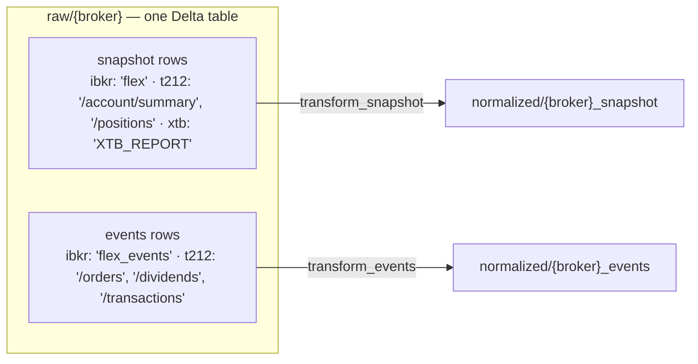

# Raw-layer shape and transform routing

## Before: per-broker × per-layer raw tables (6 tables, one identical schema)

```
raw/ibkr_snapshot        raw/ibkr_events
raw/trading212_snapshot  raw/trading212_events
raw/xtb_snapshot  ────── feeds BOTH silvers (events_raw_layer = "snapshot")
raw/xtb_events    ────── orphan: never written; table-lineage.md draws a false edge to it
```

Each pair feeds the two silver tables via `transform_snapshot` / `transform_events`, with the raw layer selected per connector (`events_raw_layer`) and an XTB-only branch in `fetch_connector`.

## After: one raw table per broker, `source` discriminates data kind



## Routing rules (CAP-3)

- Snapshot transform reads the same `raw/{broker}` table and consumes only snapshot sources (per-`source` `filter_latest_snapshot` stays).
- Events transforms include-filter event sources **before** payload unwrapping, so a bare-JSON-list payload (Trading 212 `/equity/positions`) can never be treated as events.
- Silver tables and their consumers are untouched — this diagram only changes what raw paths the transforms read.
