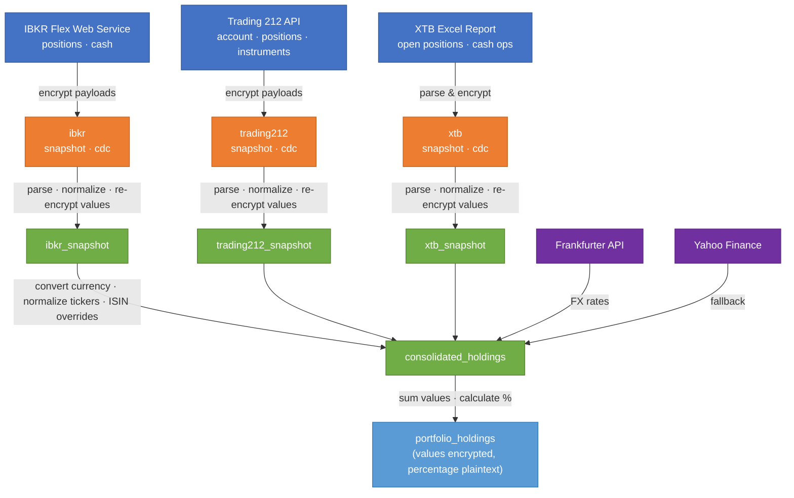

# Architecture

## Medallion Pipeline

The `pipeline/` package implements a medallion architecture (raw → normalized →
analytics) with Delta tables and Fernet encryption for sensitive financial data.

### Data flow

Each layer stores data in Delta tables under `data/`:

| Layer | Node color | Table | Contents |
|-------|-----------|-------|----------|
| 🔵 Sources | Blue | — | Broker APIs and files |
| 🟠 Raw | Orange | `raw/{broker}_snapshot` | Encrypted API payloads with fetch metadata |
| 🟠 Raw | Orange | `raw/{broker}_cdc` | Encrypted change-data-capture payloads |
| 🟢 Normalized | Green | `normalized/{broker}_snapshot` | Structured positions & cash rows; financial values remain Fernet-encrypted |
| 🟢 Normalized | Green | `normalized/consolidated_holdings` | Cross-broker holdings converted to target currency; financial values remain Fernet-encrypted |
| 🟣 FX Rates | Purple | — | Frankfurter API (primary) / Yahoo Finance (fallback) |
| 🔵 Analytics | Light blue | `analytics/portfolio_holdings` | Portfolio holdings with encrypted values and plaintext percentages |

### Table naming convention

Table names follow the `{name}_{layer}` convention:

| Table | Layer |
|-------|-------|
| `ibkr_snapshot_raw` | Raw |
| `ibkr_snapshot_normalized` | Normalized |
| `trading212_snapshot_raw` | Raw |
| `trading212_snapshot_normalized` | Normalized |
| `xtb_snapshot_raw` | Raw |
| `xtb_snapshot_normalized` | Normalized |
| `consolidated_holdings_normalized` | Normalized |
| `portfolio_holdings_analytics` | Analytics |

### Encryption

Financial values are encrypted at rest using Fernet (symmetric encryption) before
being stored in Delta tables. The encryption key is provided via the
`ENCRYPTION_KEY` environment variable and is **never stored in S3 or in config
files**. The `--decrypt` flag on query commands decrypts values for
human-readable output.

### Table lineage

For a comprehensive Mermaid diagram showing the full data flow from raw through
normalized to analytics and report charts, see [table-lineage.md](table-lineage.md).
