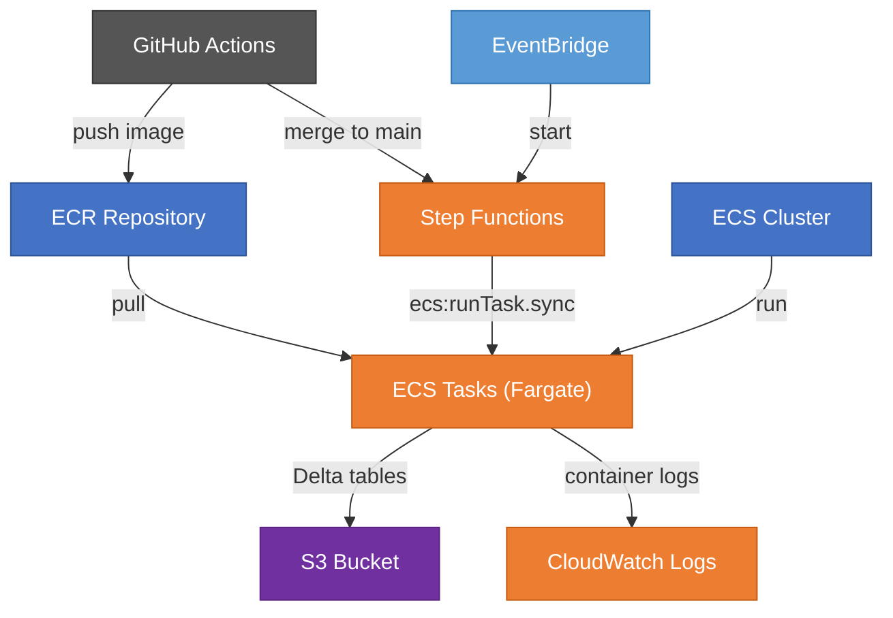
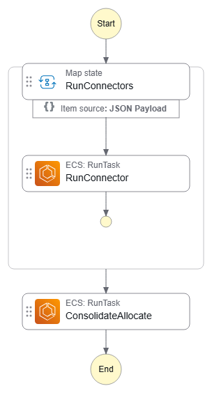

# AWS Deployment

## Architecture

The pipeline runs on AWS Fargate, orchestrated by Step Functions, with
per-environment isolation (demo / prod). Terraform in `terraform/` manages
all resources.



## Step Functions workflow



The orchestrator runs connectors in parallel (Map state, max concurrency 3),
then consolidates results:

1. **RunConnectors** — fans out across enabled brokers (IBKR, Trading 212, XTB),
   each as an ECS Fargate task. Retries up to 2× on failure with exponential
   backoff (30 s → 60 s).
2. **ConsolidateAllocate** — after all connectors succeed, runs a single ECS task
   that merges holdings, converts currencies, and computes portfolio allocation.

## Terraform

### Apply order

```bash
# 1. Shared infrastructure (ECR, ECS cluster, IAM roles) — once
cd terraform/shared
terraform init
terraform apply

# 2. Copy shared outputs into env tfvars
#    terraform output ecr_repository_url
#    terraform output ecr_push_pull_policy_arn
#    terraform output ecs_cluster_arn

# 3. Per-environment infrastructure — each independently
cd terraform/demo
terraform init
terraform apply

cd terraform/prod
terraform init
terraform apply
```

### Post-apply steps

1. **Seed SSM secrets** — Terraform creates parameter names with `PLACEHOLDER`
   values and `lifecycle ignore_changes`. Set real values manually (see
   [SSM secrets reference](#ssm-secrets-reference) below).
2. **Push Docker image** to ECR so task definitions have something to run.
3. **Store outputs** in GitHub Secrets: `access_key_id`, `s3_bucket`, `s3_prefix`
   (and `_DEMO` variants for demo).

### SSM secrets reference

Terraform creates all SSM parameters with `PLACEHOLDER` values. After the first
`terraform apply`, seed each parameter with its real value using
`aws ssm put-parameter`. Subsequent applies will **not** overwrite seeded values
because every parameter has `lifecycle { ignore_changes = [value] }`.

#### Demo environment

Replace `<kms-key-id>` with the output of `terraform output kms_key_arn` from
`terraform/demo/`.

| SSM parameter name | Env var in container | Description |
|---|---|---|
| `/portfolio/demo/IBKR_FLEX_TOKEN_DEMO` | `IBKR_FLEX_TOKEN_DEMO` | IBKR Flex Token |
| `/portfolio/demo/IBKR_FLEX_QUERY_ID_DEMO` | `IBKR_FLEX_QUERY_ID_DEMO` | IBKR Flex Query ID |
| `/portfolio/demo/T212_API_KEY_DEMO` | `T212_API_KEY_DEMO` | Trading 212 API Key |
| `/portfolio/demo/T212_API_SECRET_DEMO` | `T212_API_SECRET_DEMO` | Trading 212 API Secret |
| `/portfolio/demo/ENCRYPTION_KEY_DEMO` | `ENCRYPTION_KEY_DEMO` | Fernet encryption key for Delta table values |

```bash
KMS_KEY_ID=$(terraform -chdir=terraform/demo output -raw kms_key_arn)

aws ssm put-parameter --name /portfolio/demo/IBKR_FLEX_TOKEN_DEMO   --value "TOKEN"    --type SecureString --key-id "$KMS_KEY_ID" --overwrite
aws ssm put-parameter --name /portfolio/demo/IBKR_FLEX_QUERY_ID_DEMO --value "QUERY_ID" --type SecureString --key-id "$KMS_KEY_ID" --overwrite
aws ssm put-parameter --name /portfolio/demo/T212_API_KEY_DEMO      --value "API_KEY"  --type SecureString --key-id "$KMS_KEY_ID" --overwrite
aws ssm put-parameter --name /portfolio/demo/T212_API_SECRET_DEMO   --value "SECRET"   --type SecureString --key-id "$KMS_KEY_ID" --overwrite
aws ssm put-parameter --name /portfolio/demo/ENCRYPTION_KEY_DEMO    --value "FERNET"   --type SecureString --key-id "$KMS_KEY_ID" --overwrite
```

#### Production environment

Replace `<kms-key-id>` with the output of `terraform output kms_key_arn` from
`terraform/prod/`.

| SSM parameter name | Env var in container | Description |
|---|---|---|
| `/portfolio/prod/IBKR_FLEX_TOKEN` | `IBKR_FLEX_TOKEN` | IBKR Flex Token |
| `/portfolio/prod/IBKR_FLEX_QUERY_ID` | `IBKR_FLEX_QUERY_ID` | IBKR Flex Query ID |
| `/portfolio/prod/T212_API_KEY` | `T212_API_KEY` | Trading 212 API Key |
| `/portfolio/prod/T212_API_SECRET` | `T212_API_SECRET` | Trading 212 API Secret |
| `/portfolio/prod/ENCRYPTION_KEY` | `ENCRYPTION_KEY` | Fernet encryption key for Delta table values |

```bash
KMS_KEY_ID=$(terraform -chdir=terraform/prod output -raw kms_key_arn)

aws ssm put-parameter --name /portfolio/prod/IBKR_FLEX_TOKEN    --value "TOKEN"    --type SecureString --key-id "$KMS_KEY_ID" --overwrite
aws ssm put-parameter --name /portfolio/prod/IBKR_FLEX_QUERY_ID --value "QUERY_ID" --type SecureString --key-id "$KMS_KEY_ID" --overwrite
aws ssm put-parameter --name /portfolio/prod/T212_API_KEY       --value "API_KEY"  --type SecureString --key-id "$KMS_KEY_ID" --overwrite
aws ssm put-parameter --name /portfolio/prod/T212_API_SECRET    --value "SECRET"   --type SecureString --key-id "$KMS_KEY_ID" --overwrite
aws ssm put-parameter --name /portfolio/prod/ENCRYPTION_KEY     --value "FERNET"   --type SecureString --key-id "$KMS_KEY_ID" --overwrite
```

> **Important:** The `ENCRYPTION_KEY` must match the Fernet key used to write
> existing raw Delta tables. If you seed a different key, previously encrypted
> data becomes unreadable. Verify the key before the first cloud run.

> **Note:** AWS credential SSM parameters (`AWS_ACCESS_KEY_ID`,
> `AWS_SECRET_ACCESS_KEY` and their `_DEMO` variants) are **not** needed. ECS
> tasks use IAM role credentials instead (see
> [ADR 0055](../adr/0055-iam-role-credential-fallback.md)).

## CI/CD

| Trigger | Action |
|---------|--------|
| Push to `main` | Build & push Docker image → start demo Step Functions execution |
| Tag push `v*` | Build & push Docker image with version tag + `production-latest` |
| Manual dispatch | Run pipeline directly via GitHub Actions (supports demo toggle) |
