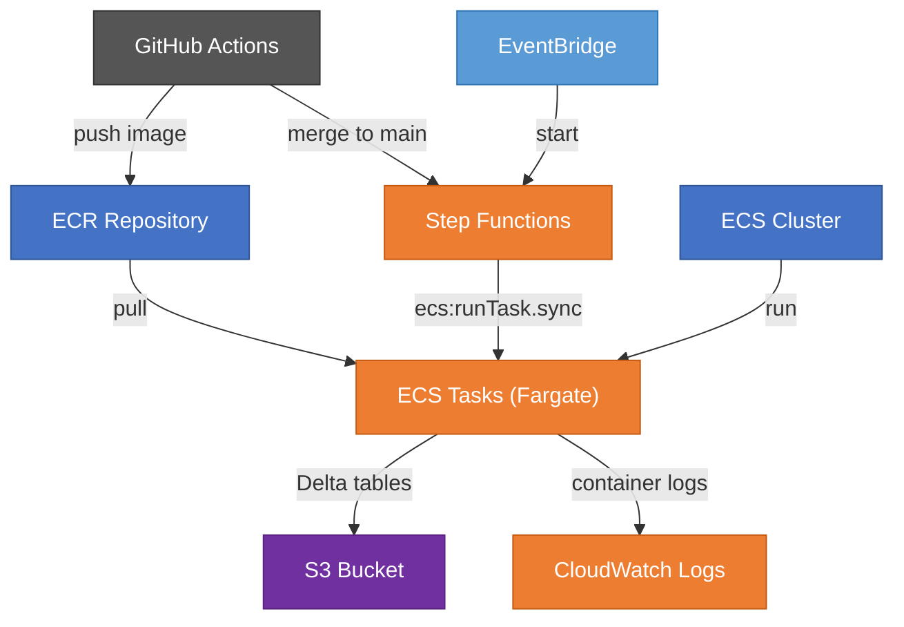

# AWS Deployment

## Architecture

The pipeline runs on AWS Fargate, orchestrated by Step Functions, with
per-environment isolation (demo / prod). Terraform in `terraform/` manages
all resources.



## Step Functions workflow


The orchestrator runs connectors in parallel (Map state, max concurrency 3),
then consolidates results:

1. **RunConnectors** — fans out across enabled brokers (IBKR, Trading 212, XTB),
   each as an ECS Fargate task. Retries up to 2× on failure with exponential
   backoff (30 s → 60 s).
2. **ConsolidateAllocate** — after all connectors succeed, runs a single ECS task
   that merges holdings, converts currencies, and computes portfolio allocation.

## Terraform

### Apply order

```bash
# 1. Shared infrastructure (ECR, ECS cluster, IAM roles) — once
cd terraform/shared
terraform init
terraform apply

# 2. Copy shared outputs into env tfvars
#    terraform output ecr_repository_url
#    terraform output ecr_push_pull_policy_arn
#    terraform output ecs_cluster_arn

# 3. Per-environment infrastructure — each independently
cd terraform/demo
terraform init
terraform apply

cd terraform/prod
terraform init
terraform apply
```

### Post-apply steps

1. **Seed SSM secrets** — Terraform creates parameter names with `PLACEHOLDER`
   values and `lifecycle ignore_changes`. Set real values manually:
   ```bash
   aws ssm put-parameter --name /portfolio/demo/IBKR_FLEX_TOKEN_DEMO \
     --value "real-token" --type SecureString --key-id <kms-key-id>
   ```
2. **Push Docker image** to ECR so task definitions have something to run.
3. **Store outputs** in GitHub Secrets: `access_key_id`, `s3_bucket`, `s3_prefix`
   (and `_DEMO` variants for demo).

## CI/CD

| Trigger | Action |
|---------|--------|
| Push to `main` | Build & push Docker image → start demo Step Functions execution |
| Tag push `v*` | Build & push Docker image with version tag + `production-latest` |
| Manual dispatch | Run pipeline directly via GitHub Actions (supports demo toggle) |
