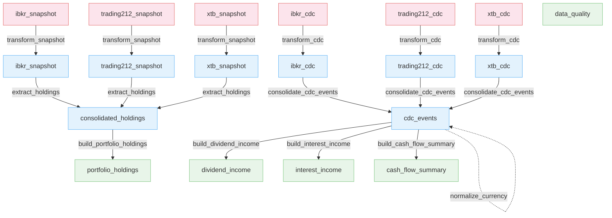
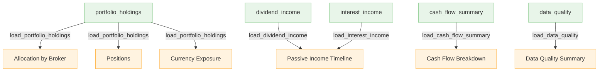

# Table Lineage

This document describes how data moves through the pipeline. The lineage is split into two views:

1. **Storage lineage** – raw ingestion through normalized and analytics tables.
2. **Report lineage** – which analytics tables feed each report section.

---

# Storage Lineage

---

# Report Lineage

---

## Notes

* **Snapshot vs CDC tracks never merge.** `consolidated_holdings` is built from broker position snapshots, while `cdc_events` is built from transaction history.
* **`normalize_currency()` enriches `cdc_events` in place**, adding `target_fx_rate`, `target_value`, and `target_ccy`.
* **Gold value columns are Fernet-encrypted.** Monetary values (`security_value`, `target_value`, `cash_amount`) are stored as `pa.binary()`. Metadata columns remain plaintext.
* **Allocation charts** use the plaintext `percentage` column and therefore do not require decryption.
* **Data quality** is a validation stage that scans every normalized and gold table before producing the `data_quality` report. It is included in the storage lineage as a gold table, but its validation edges (reading all tables) are omitted for clarity.

