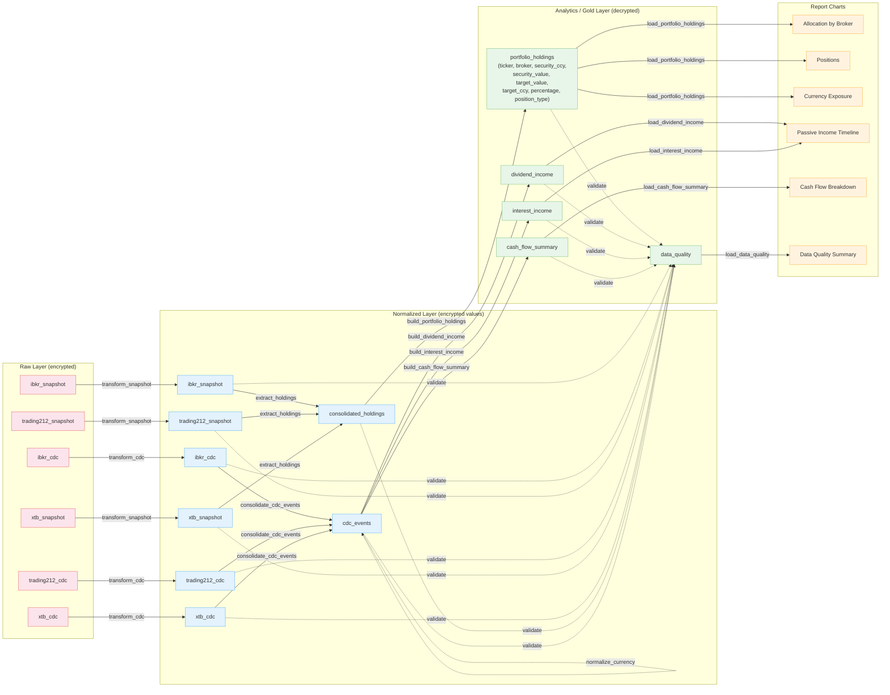

# Table Lineage

Pipeline data flow from raw ingestion through normalization to analytics and reports.

## Notes

- **Snapshot vs CDC tracks never merge.** `consolidated_holdings` comes from broker
  position snapshots; `cdc_events` comes from transaction history. They feed separate
  gold tables.
- **`cdc_events` self-references.** `normalize_currency()` reads, enriches, and overwrites
  the same table (adds `target_fx_rate`, `target_value`, `target_ccy`).
- **Allocation charts and the positions chart** read from `portfolio_holdings`. The
  donut charts group by `broker` or `security_ccy` and sum `target_value`; the
  positions chart renders each row individually using the `percentage` column.
- **Data quality** (dotted lines) reads all normalized and gold tables but is not a
  data-flow dependency.